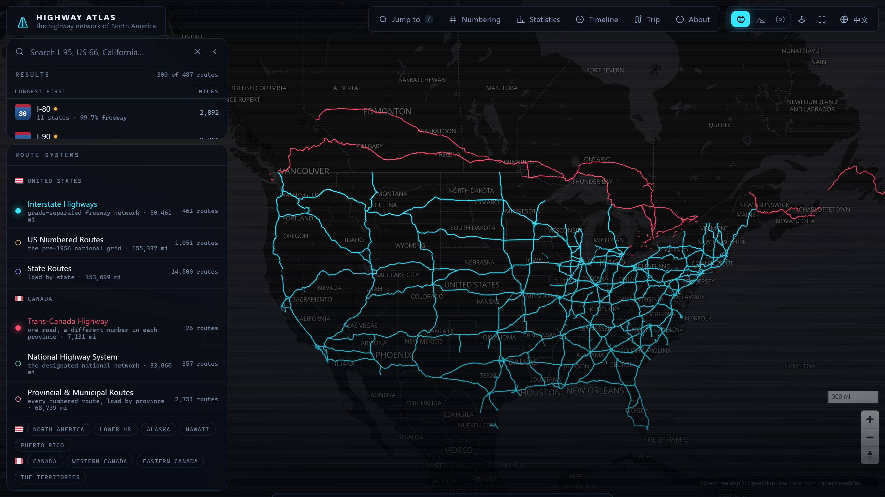
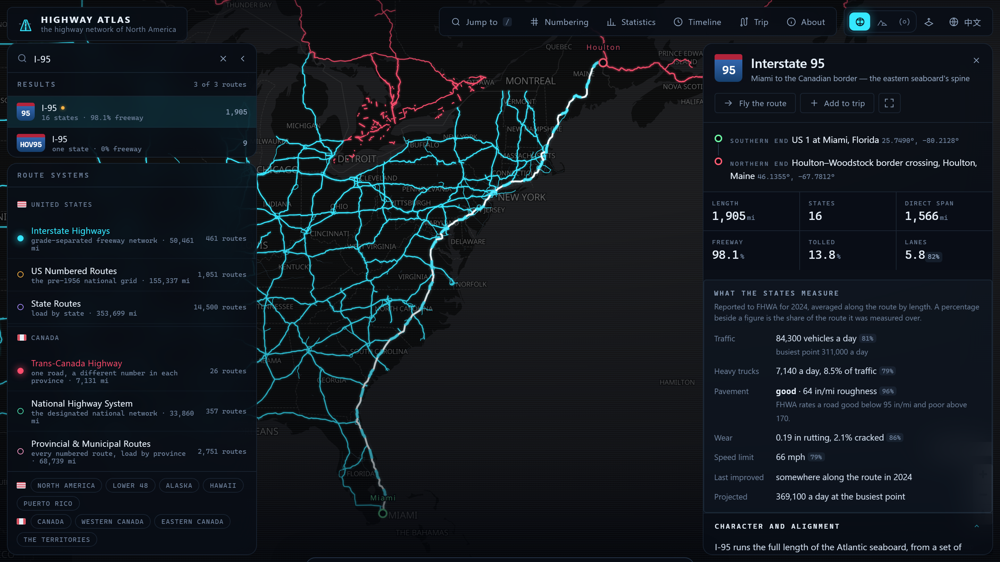
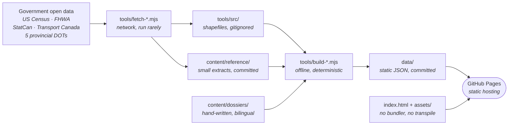

<div align="center">

<h1>Highway Atlas</h1>

<h3><em>the highway network of North America</em></h3>

<p>
An interactive, bilingual atlas of every numbered highway in the United States and Canada —
the Interstates, the US numbered routes, every state route system, the Trans-Canada
Highway, Canada's National Highway System and every numbered provincial route — with a
written record for the roads that have one.
</p>

[](https://andyuneducated.github.io/interstate-atlas/)
[](docs/ARCHITECTURE.md)

<br/>


<sub><b>[Live site](https://andyuneducated.github.io/interstate-atlas/)</b> ·
[Architecture](docs/ARCHITECTURE.md) ·
[Coverage](#coverage) ·
[On accuracy](#on-accuracy) ·
[Data sources](#data-sources) ·
[Dependencies](#dependencies) ·
[Building](#building) ·
[Second machine](#working-on-a-second-machine)</sub>

<br/>

[](https://andyuneducated.github.io/interstate-atlas/)

<sub>The Interstates in cyan, the Trans-Canada in red, on the continent they actually cover.</sub>

</div>

---

> [!NOTE]
> **Counts move; method does not.** Every route total, mileage and percentage on this page
> is read back from the published build dated **2026-09-17** (`data/index.json`,
> `data/stats.json`) and changes whenever the pipeline is re-run against fresher source
> data. The rules those numbers obey — what counts as measured, what counts as published,
> and what is never filled in — are in [On accuracy](#on-accuracy) and do not change.

## What it does

| | |
| --- | --- |
| **Map** | MapLibre GL over a dark vector basemap, with satellite and terrain alternatives and every route in the network selectable. |
| **Route detail** | Termini, length, per-jurisdiction mileage, roadway classification and grade separation measured off the geometry; alongside them, what the states and provinces themselves measured — traffic, heavy-truck volume, pavement roughness, rutting and cracking, lanes, posted speeds — each stating the share of the road it covers. For curated routes, a written account of how the road came to be, what it cost, what it carries and what condition it is in. |
| **Buildout scrubber** | A docked timeline over the live map. The scrub track *is* FHWA's mileage curve, which runs 1960–1997; the playhead runs from 1956, the year of the Act, to the latest documented completion, and routes light up as their documented year arrives. |
| **Flythrough** | Follows a route's mainline end to end with the camera down on the pavement. |
| **Numbering explainer** | Why I-5 is on the west coast and I-95 on the east, and why the US routes run the other way — drawn rather than described. |
| **Statistics dashboard** | Network totals by system and by jurisdiction, both countries. |
| **Elevation profiles** | Sampled from open terrain data for curated routes. |
| **Trip planner** | Chain routes into an itinerary. |
| **Command palette** | <kbd>/</kbd> or <kbd>Ctrl</kbd>+<kbd>K</kbd> to reach any route, jurisdiction or view. |
| **Map on its own** | <kbd>Z</kbd> fades every panel off the map and back again. |
| **Bilingual** | Full English and 简体中文 parity, enforced by a build check. Quebec routes keep their official French names in both modes, with an English gloss. |



<sub>I-95 selected. The percentage beside a reported figure is the share of the route it was
measured over — 81% for traffic, 96% for pavement — because partial coverage is stated rather
than rounded up to the whole road.</sub>

## How it fits together

Nothing is computed in the browser that could be computed once, offline. Government open
data is downloaded by the `fetch-*` scripts, turned into routes by the `build-*` scripts,
and committed to `data/` as plain JSON. The site is those files plus an HTML page and six
ES modules, served as-is.



The interesting half is `build-data.mjs`: the source files are not routes but road
fragments, and reassembling them is most of the work. That is the subject of
**[docs/ARCHITECTURE.md](docs/ARCHITECTURE.md)**, which has the detailed pipeline
diagram, the stitching algorithm step by step, the client module graph, and a table of
every source quirk that produced a visibly wrong atlas before it was handled.

## Coverage

21,026 routes across 96 states, provinces and territories, measuring 712,114 miles of
road, in the build dated 2026-09-23.

| Country | System | Routes | Miles | Notes |
| --- | --- | --- | --- | --- |
| 🇺🇸 | Interstate Highways | 461 | 50,461 | includes Alaska's four unsigned A-series and Hawaii's H-series |
| 🇺🇸 | US Numbered Routes | 1,051 | 155,337 | the pre-1956 grid, numbered opposite to the Interstates |
| 🇺🇸 | State Routes | 14,500 | 353,699 | 50 states, DC and Puerto Rico, loaded per state |
| 🇨🇦 | Trans-Canada Highway | 26 | 7,131 | the designation, traced across the provincial highways that carry it |
| 🇨🇦 | National Highway System | 357 | 33,860 | Core, Feeder, and Northern and Remote, as designated by Transport Canada |
| 🇨🇦 | Provincial & Municipal Routes | 2,751 | 68,739 | 12 provinces and territories, loaded per jurisdiction |
| 🇲🇽 | Federal Highways | 250 | 21,816 | numbered roads the federation administers; 35,109 km of INEGI's 51,310 km federal network, the rest being unnumbered |
| 🇲🇽 | State Highways | 1,630 | 21,071 | numbered state-administered roads in all 32 states, loaded per state; most state roads carry no number (see Known gaps) |

Nunavut has no numbered route in the national road file, and no road connects it to the
rest of the country, so it appears in no tier.

## On accuracy

This is the part worth reading before trusting a number on the site.

Two kinds of figure appear, and they are never mixed:

**Measured.** Length, endpoints, per-jurisdiction mileage, straight-line span and
roadway-class composition are computed here from surveyed road geometry, thinned for
drawing but not redrawn. A route is measured along the single path from one end of it to
the other, so a divided highway counts once rather than once per carriageway. Across the
262 routes where an official figure exists to check against, the median disagreement is
−0.2%: three-fifths land within 5%, four-fifths within 10%.

The larger disagreements are mostly explained rather than wrong, and the site explains them
instead of splitting the difference. FHWA credits pavement shared by two Interstates to one
of them, so where I-90 runs along the Indiana Toll Road with I-80 those miles are I-80's in
the register and both roads' here — which is why I-90 measures 13.7% longer than published.
The register also has slips of its own: it gives Knoxville's I-640, a beltway of about seven
miles, as 77.29. Both figures are always shown, and neither is bent toward the other.

**Reported.** Traffic volume, heavy-truck volume, pavement roughness, rutting, cracking,
lane counts, posted speeds and the year a road was last improved are what the states
measured and reported to FHWA, joined to a route by its designation and never by position.
Coverage is uneven by design — pavement condition is surveyed thoroughly on the National
Highway System and patchily elsewhere — so every one of these figures states the share of
the route it was measured over, and nothing is filled in where a state reported nothing.

Canada has no equivalent. There is no national traffic collection, because counting is
provincial and each province decides for itself whether to publish, in what form and under
what terms. Seven publish route-level counts in machine-readable form and are read here;
six do not, and their routes carry no traffic figure rather than an inferred one. The asymmetry is real and
the site states it rather than papering over it.

| Jurisdiction | Counts published in bulk | Read here |
| --- | --- | --- |
| Quebec | WFS, updated daily, CC-BY, with heavy-vehicle share; annual, summer and winter, ten years | ✅ |
| Ontario | 2024 spreadsheet, no licence stated by the publisher | ✅ |
| Alberta | 2025 spreadsheet, per-highway weighted, with vehicle classification; site history 1963–2025 | ✅ |
| Nova Scotia | 2005–2025 census, Open Government Licence, with truck share and speeds | ✅ |
| New Brunswick | 2023 count stations, Open Government Licence | ✅ |
| Northwest Territories | Table 107, 2011–2024, published as estimates | ✅ |
| Prince Edward Island | ArcGIS feature services, 2015–2018 | ✅ |
| British Columbia | interactive map only; the catalogue's copy stops at 2010 | ❌ |
| Saskatchewan | PDF map | ❌ |
| Manitoba | web application and PDF | ❌ |
| NL, YT, NU | no machine-readable traffic publication found | ❌ |

Each figure is an average along the route, weighted by length, shown beside the volume at
the road's busiest point where the two differ — Highway 401 averages 73,700 vehicles a day
along its length but carries 511,400 between Highway 427 and Renforth Drive, which is the
highest single-point count anywhere in this atlas, on either side of the border. Ontario's
Highway 407 is the one conspicuous blank: the tolled section runs under a 99-year
concession and is excluded from the ministry's counts, and the figure its operator
publishes is average workday trips, which is not a daily volume and is not shown here as
though it were.

**Published.** Official Interstate mileage comes from the FHWA Route Log and Finder List;
Canadian designations and network mileage come from Transport Canada. Everything in a
written dossier — costs, traffic counts, construction dates, condition — carries its own
source line naming the publication and its date.

Where no published figure exists, the site says so explicitly rather than estimating. A
1,900-mile Interstate assembled over six decades by sixteen jurisdictions has no single
construction cost, and the page says that instead of inventing one. The content build
enforces this: a figure must either carry a source or carry an explanation of why it is
absent, and English and Chinese must both be present. `node tools/build-content.mjs` fails
the build otherwise.

The same honesty applies to what the data cannot distinguish. Canada's national road file
records county and municipal route numbers in the same field as provincial highway numbers,
with nothing to tell them apart — twenty-two separate Ontario roads carry the number 21.
Both are published here rather than guessed at, the tier is named for it,
and each road is listed with the place that identifies it.

## Known gaps

What the atlas does not have, and whether that is a limit of the sources or unfinished
work. "Source" means no publisher releases it in a usable form; "pending" means it is
available and not yet built.

| Country | Gap | Kind | Detail |
| --- | --- | --- | --- |
| 🇲🇽 | Opening years | source | Neither INEGI nor SICT publishes when a road opened. SICT's bridge inventory dates 9,818 federal free-network bridges; those are shown as bridges and not used to date roads. |
| 🇲🇽 | Most state highways | source | Most states do not number their state roads. SICT's own 2025 listing gives 243 of the 711 state roads it counts a number, and only numbered roads can become routes. The state tier is the numbered minority of INEGI's 103,787 km state network. |
| 🇲🇽 | Toll and free twins | source | The road file almost never writes the D suffix, so MEX-15 and MEX-15D share one number. A federal route can mix a toll and a free alignment, and parallel stretches show up as separate pieces under one number. Toll share comes from the file's per-segment toll flag. |
| 🇲🇽 | Which state a federal road is in | source | The road file records the federation rather than the state as the jurisdiction of federal segments. The per-state breakdown is located against Natural Earth's 1:10m boundaries, and each route page says so. |
| 🇲🇽 | Route ends | source | There is no gazetteer in the Mexican pipeline, so each end is given as the SICT section (tramo) it lies on rather than as a town. |
| 🇲🇽 | Unnumbered roads | source | Unnumbered federal and state carreteras are drawn only as faint background, and only stretches of 2 km or more. Municipal and private carreteras are not drawn. |
| 🇲🇽 | Speed limits | source | `VELOCIDAD` is a routing parameter, not a posted limit, and is not shown. |
| 🇲🇽 | Traffic on unnumbered roads | source | SICT count stations on roads with no number, or more than 5 km from their numbered route, are not placed. |
| 🇲🇽 | Spanish interface | pending | English and Chinese only. |
| 🇲🇽 | Numbering explainer, construction timeline | pending | Neither has a Mexico view yet. |
| 🇲🇽 | Cross-check of RNC numbers against SICT's | pending | Chihuahua disagrees most. |
| 🇲🇽 | CAPUFE toll-road traffic and tariffs | pending | Monthly flows and historical tariffs are published separately and not yet read. |
| 🇨🇦 | Traffic in BC, SK, MB, NL, YT, NU | source | Not published in machine-readable form (see the table above). |
| 🇨🇦 | Opening years outside Quebec | source | The *Canada Year Book* (1951–1968, 1973) never reported Trans-Canada completion by province. Saskatchewan (21 August 1957) is the one exception. The only other dated event is the national opening on 3 September 1962, which was not a completion. The 1969–1972 editions, which would cover the programme's end, are missing from Statistics Canada's digitised collection. The Act, its amendments and each province's agreement date are on the timeline. Ontario's bridge years are shown as bridges only. |
| 🇨🇦 | Nova Scotia traffic join | pending | 93% of counts attach. Joining on the province's own segment geometry would close the rest. |
| 🇨🇦 🇲🇽 | Border crossings, toll facilities | pending | CBSA and SICT crossing lists, 407 ETR, Confederation Bridge, Cobequid Pass. |

## Data sources

### United States

| Source | Used for | Licence |
| --- | --- | --- |
| [US Census TIGER/Line](https://www.census.gov/geographies/mapping-files/time-series/geo/tiger-line-file.html) 2025 primary and secondary roads, 52 files | route geometry and designations | public domain |
| [FHWA HPMS](https://data.transportation.gov/Roadways-and-Bridges/HPMS-Spatial-All-Sections-2024/42um-tgh5) *Spatial All Sections* 2024 | traffic counts, truck volumes, pavement roughness, rutting, cracking, lanes, speed limits, tolls, year last improved | US government work |
| [US Census Gazetteer](https://www.census.gov/geographies/reference-files/time-series/geo/gazetteer-files.html) 2023 places | terminus naming (32,329 places) | public domain |
| [FHWA Route Log and Finder List](https://www.fhwa.dot.gov/planning/national_highway_system/interstate_highway_system/routefinder/) | official Interstate mileage, urban areas served | US government work |
| FHWA *Interstate System Mileage Open to Traffic*, 1960–1997 | the buildout curve | US government work |

### Canada

| Source | Used for | Licence |
| --- | --- | --- |
| [Statistics Canada National Road Network](https://www.statcan.gc.ca/en/lode/databases/odr) (NRN) | route geometry, road class, lanes, posted speed, surface, place names | Open Government Licence – Canada |
| [Transport Canada National Highway System](https://open.canada.ca/data/en/dataset/2dac78ba-8b48-4bec-8290-cbdda8474f97) | Core / Feeder / Northern and Remote designation | Open Government Licence – Canada |
| Transport Canada *NHS Annual Report* 2017 | published NHS mileage by jurisdiction and tier | Open Government Licence – Canada |
| [Québec *Débit de circulation*](https://www.donneesquebec.ca/recherche/dataset/debit-de-circulation) | DJMA and heavy-vehicle share, Quebec | CC-BY 4.0 |
| [Ontario *Provincial Highways Traffic Volumes*](https://www.library.mto.gov.on.ca/SydneyPLUS/TechPubs/Portal/tp/tvSplash.aspx) 2024 | AADT, Ontario | no licence stated by the publisher |
| [Alberta *Traffic volumes on links in the highway network*](https://open.alberta.ca/opendata/traffic-volumes-on-links-in-the-highway-network) 2025 | WAADT and commercial share, Alberta | Open Government Licence – Alberta |
| [Nova Scotia *Traffic Volumes – Provincial Highway System*](https://data.novascotia.ca/Roads-Driving-and-Transport/Traffic-Volumes-Provincial-Highway-System/8524-ec3n) | AADT, truck share, 85th-percentile speed | Open Government Licence – Nova Scotia |
| [New Brunswick *AADT counts at point locations*](https://gnb.socrata.com/datasets/gdx2-xdus) 2023 | AADT, New Brunswick | Open Government Licence – New Brunswick |

### Mexico

| Source | Used for | Licence | Refresh |
| --- | --- | --- | --- |
| [INEGI / SICT / IMT *Red Nacional de Caminos*](https://www.inegi.org.mx/programas/rnc/) 2025, `red_vial` | route geometry, designation (CODIGO), administering body, toll flag, lanes, surface, divided | Términos de Libre Uso (INEGI) | annual, each December |
| [SICT *Datos Viales*](https://www.datos.gob.mx/dataset/datos_viales) 2013–2024 | TDPA and vehicle mix at 9,138 count stations | Términos de Libre Uso MX | annual |
| SICT *Datos Viales* 2025, per-state PDF indexes | which state roads SICT itself lists, and which of them carry a number | Términos de Libre Uso MX | annual; file names and layout changed between 2024 and 2025 |
| [Natural Earth](https://www.naturalearthdata.com/downloads/10m-cultural-vectors/10m-admin-1-states-provinces/) Admin 1, 1:10m | locating federal segments within states | public domain | rarely |

### Both

| Source | Used for | Licence |
| --- | --- | --- |
| [Terrain Tiles](https://registry.opendata.aws/terrain-tiles/) (AWS Open Data) | elevation profiles | open data |
| [OpenFreeMap](https://openfreemap.org/) | vector basemap | open |
| [Esri World Imagery](https://www.arcgis.com/home/item.html?id=10df2279f9684e4a9f6a7f08febac2a9) | satellite basemap | Esri terms |

## Dependencies

Three npm packages in total, none of them served to the browser.

| Scope | Package | Declared | Used by | What for |
| --- | --- | --- | --- | --- |
| `dependencies` | [shapefile](https://github.com/mbostock/shapefile) | `^0.6.6` | `tools/tiger.mjs`, `tools/canada.mjs` | streams the TIGER/Line and NRN `.shp`/`.dbf` pairs; both readers open them a feature at a time so a 417 MB province need not be held in memory |
| `dependencies` | [pngjs](https://github.com/pngjs/pngjs) | `^7.0.0` | `tools/build-elevation.mjs` | decodes Terrarium terrain tiles, which pack metres above sea level into RGB |
| `devDependencies` | [playwright-core](https://playwright.dev/) | `^1.63.0` | `tools/verify.mjs` | drives the real site in headless Chromium |

**Nothing from npm reaches the browser.** The one third-party library the page loads is
MapLibre GL JS, vendored into the repository rather than fetched from a CDN — a static
atlas should not stop working because someone else's origin is having a bad day.

| | Version | Path | Loaded by |
| --- | --- | --- | --- |
| [MapLibre GL JS](https://maplibre.org/) | 4.7.1 | `assets/vendor/maplibre-gl.js`, `assets/vendor/maplibre-gl.css` | a plain `<script>` and `<link>` in `index.html` |

Everything else the build needs is written here in plain Node with no dependencies of its
own: route stitching and the shortest-path search (`tools/geo.mjs`), Douglas–Peucker
simplification, the gazetteer spatial index, the ZIP reader (`tools/unzip.mjs`, which
handles Zip64 because the Canadian archives cross 4 GB uncompressed) and an `.xlsx` reader
(`tools/xlsx.mjs`, narrow enough to read the two provincial spreadsheets and nothing else).

The page itself needs no API key and no account. At runtime it does talk to three public
tile services, all of them optional to the atlas's own data:

| Service | When | Needed for |
| --- | --- | --- |
| [OpenFreeMap](https://openfreemap.org/) `tiles.openfreemap.org` | always | the dark vector basemap under the routes |
| [AWS Terrain Tiles](https://registry.opendata.aws/terrain-tiles/) `s3.amazonaws.com` | on demand | hillshading and the 3D terrain mesh |
| [Esri World Imagery](https://www.arcgis.com/home/item.html?id=10df2279f9684e4a9f6a7f08febac2a9) `server.arcgisonline.com` | on demand | the satellite basemap |

## Building

There is no build step for the site — `index.html` and `assets/` are served exactly as
they sit in the repository. The scripts below rebuild the *data*, and only need running
when the upstream sources change.

| Script | Does | Writes |
| --- | --- | --- |
| `npm run fetch` | downloads the Census gazetteer, the FHWA Route Log and HPMS | `tools/src/`, `content/reference/` |
| `npm run fetch:ca` | downloads the StatCan NRN, the Transport Canada NHS and provincial traffic | `tools/src/ca/`, `content/reference/` |
| `npm run fetch:qc` | scrapes the MTQ répertoire for autoroute opening years | `content/reference/qc-autoroutes.json` |
| `npm run fetch:mx` | downloads the INEGI Red Nacional de Caminos and the SICT traffic panel | `tools/src/mx/`, `content/reference/` |
| `npm run fetch:mx:check` | preflight only: what is reachable, how big, and whether it can resume | — |
| `npm run fetch:all` | every acquisition step above, in order | all of the above |
| `npm run build` | `build-data.mjs`, then `build-content.mjs` | `data/geo/`, `data/index.json`, `data/stats.json`, `data/dossiers/`, `data/timeline.json` |
| `npm run build:elevation` | samples terrain along curated routes | `data/elevation/` |
| `npm run serve` | serves the repository on `http://localhost:8787` | — |
| `npm test` | i18n parity, then content validation | — |
| `npm run verify` | drives the served site in headless Chromium | `tools/shots/` (gitignored) |

```sh
npm install

npm run fetch:all       # acquire everything — slow, run rarely
npm run build           # geometry and prose — deterministic, offline
npm run build:elevation # optional: sample terrain along curated routes

npm run serve           # http://localhost:8787
npm test                # i18n parity, then content validation
npm run verify          # headless run-through against the served site
```

TIGER/Line is the exception to `fetch:all`: it downloads itself per state on the first
build, into `tools/src/tiger/`, so the first `npm run build` needs the network.

`node tools/build-data.mjs` is much the slowest step — it is a shortest-path search over a
graph built from every road fragment in two countries, and takes tens of minutes. It needs
no network once the sources are on disk, and given the same inputs it produces the same
output. `tools/src/` (source downloads) and `tools/cache/` (terrain tiles) are gitignored;
the first elevation run fetches a few thousand tiles and is slow, and reruns are cached.

## Working on a second machine

A fresh clone serves the site immediately — `data/` is committed — but cannot *rebuild*
the data until the sources are back on disk. Two commands put them there:

```sh
npm run fetch      # Census gazetteer, FHWA Route Log, HPMS
npm run fetch:ca   # StatCan NRN, Transport Canada NHS, provincial traffic
```

TIGER/Line is in neither: `tiger.mjs` downloads a state the first time the build reads
one. Budget about 6 GB of disk and an afternoon.

| Path | On disk | Comes from |
| --- | --- | --- |
| `tools/src/ca/` | ~5.4 GB | `fetch-canada.mjs` — a 1.5 GB download that inflates on unpacking, because shapefiles are uncompressed |
| `tools/src/tiger/` | ~476 MB | the build itself, one state at a time |
| `tools/src/2023_Gaz_place_national.txt` | 6 MB | `fetch-source.mjs` |
| `tools/cache/` | ~96 MB | `build-elevation.mjs`, only if terrain profiles are rebuilt |

Both fetchers are resumable — they skip whatever is already on disk and print what
failed — so a dropped connection costs one re-run rather than the whole download.

None of this is committed, and none of it can be: GitHub rejects any file over 100 MB
and caps a single push at 2 GB, ten of these files are over 100 MB, and this repository
is a Pages source, for which the recommended ceiling is 1 GB.

Re-fetching reproduces the US data exactly, because `TIGER_YEAR` is pinned and the Census
keeps past years. It does not reproduce the Canadian data exactly: StatCan publishes the
current edition of each province at an address with no version in it, so a later fetch
can return a newer road network and move the mileage. `tools/src/ca/editions.json`
records which edition of each province produced the data now in `data/`.

## Repository layout

| Path | Committed | What it holds |
| --- | --- | --- |
| `index.html` | ✅ | the whole page: markup, no templating, no bundler |
| `assets/*.js` | ✅ | six ES modules, loaded directly by the browser |
| `assets/vendor/` | ✅ | MapLibre GL JS 4.7.1 |
| `tools/fetch-*.mjs` | ✅ | acquisition — the only scripts that touch the network |
| `tools/build-*.mjs` | ✅ | the pipeline — offline and deterministic |
| `tools/geo.mjs`, `tiger.mjs`, `canada.mjs` | ✅ | the geospatial algorithms and the two source readers |
| `content/dossiers/` | ✅ | hand-written route profiles, English and Chinese |
| `content/reference/` | ✅ | small sourced extracts: FHWA mileage and cost, HPMS, NHS register, provincial traffic |
| `data/` | ✅ | the build's output, and the only thing the site reads |
| `docs/` | ✅ | the architecture document and the two images on this page |
| `tools/src/`, `tools/cache/`, `tools/shots/` | ❌ | downloads, tile cache and verification screenshots |

## The parts that do not change

Rebuilds move every number on this page. These are the rules they move under.

| Rule | Where it is enforced |
| --- | --- |
| A figure is either **measured** from geometry or **published** by an authority, never a blend of the two | `build-data.mjs` computes the first; `content/` carries the second with its source |
| A published figure carries a source, or an explanation of why none exists | `build-content.mjs` fails the build otherwise |
| Every English string has a Chinese counterpart, with matching placeholders | `check-i18n.mjs` fails otherwise |
| Reported figures are joined to routes by **designation, never by position** | `attachHpms` and `attachCanadianTraffic` in `build-data.mjs` |
| Any figure covering part of a road states the share it covers | every HPMS and provincial measure carries a `cover` field |
| A route's length is measured along the path you would drive, once — not over every centreline in the corridor | `stitchRoute` and `drivenEdgeKm` in `geo.mjs` |
| Where a source says nothing, the site says nothing | no defaulting to zero; `null` survives to the panel |

## Licence

Code is MIT. Written content is CC BY 4.0. The underlying data keeps the licences above.
