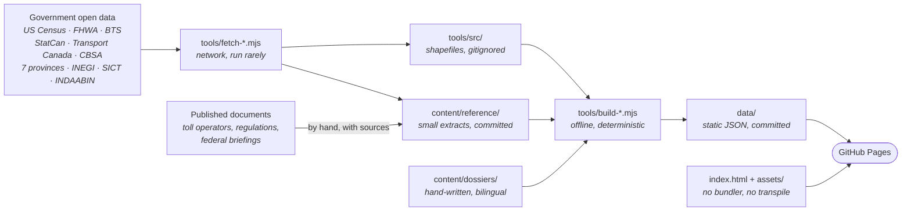

<div align="center">

<h1>Highway Atlas</h1>

<h3><em>the highway network of North America</em></h3>

<p>
An interactive, bilingual atlas of every numbered highway in the United States, Canada and
Mexico — the Interstates, the US numbered routes, every state route system, the
Trans-Canada Highway, Canada's National Highway System, every numbered provincial route,
and Mexico's federal and numbered state highways — with a written record for the roads
that have one.
</p>

[](https://andyuneducated.github.io/interstate-atlas/)
[](docs/ARCHITECTURE.md)
[](docs/ACCURACY.md)

<br/>

<!-- auto:badges -->


<!-- /auto:badges -->


<!-- auto:deps --><!-- /auto:deps -->


<sub><b>[Live site](https://andyuneducated.github.io/interstate-atlas/)</b> ·
[Architecture](docs/ARCHITECTURE.md) ·
[Accuracy](docs/ACCURACY.md) ·
[Data sources and decisions](docs/DATA-SOURCES.md) ·
[Coverage](#coverage) ·
[Known gaps](#known-gaps) ·
[Data sources](#data-sources) ·
[Building](#building) ·
[Second machine](#working-on-a-second-machine)</sub>

<br/>

[](https://andyuneducated.github.io/interstate-atlas/)

<sub>The Interstates in cyan, the Trans-Canada in red, on the continent they actually cover.</sub>

</div>

---

> [!NOTE]
> **Counts move; method does not.** Every route total, mileage and percentage on this page
> is written from the published build dated **<!-- auto:date -->2026-10-05<!-- /auto:date -->** by
> `tools/readme-figures.mjs`, which `npm test` runs, and changes whenever the pipeline is
> re-run. The rules those numbers obey are in [On accuracy](#on-accuracy) and do not change.

## What it does

| | |
| --- | --- |
| **Map** | MapLibre GL over a dark vector basemap, with satellite and terrain alternatives and every route in the network selectable. |
| **Route detail** | Termini, length, per-jurisdiction mileage, roadway classification and grade separation measured off the geometry; alongside them, what the states, provinces and SICT measured — traffic, heavy-truck volume, pavement condition, lanes, posted speeds — each stating the share of the road it covers. For curated routes, a written account of how the road came to be, what it cost, what it carries and what condition it is in. |
| **Buildout scrubber** | A docked timeline over the live map. The scrub track *is* FHWA's mileage curve, 1960–1997; the playhead runs from 1956 to the latest documented completion, and routes light up as their documented year arrives. Quebec's autoroutes and the Trans-Canada's dated events are on it too. |
| **Border crossings** | 167 land crossings on the Canada–US, Mexico–US, Mexico–Guatemala and Mexico–Belize borders, each saying how it was placed and listing the atlas routes within 2 km of it. |
| **Toll facilities** | Seven Canadian toll roads and bridges on the map, each with its operator, length, opening date and dated fares, every fact linked to its source. A route's panel lists the tolls on it, and for Mexico the federal concession titles that name it. |
| **Flythrough** | Follows a route's mainline end to end with the camera down on the pavement. |
| **Numbering explainer** | Why I-5 is on the west coast and I-95 on the east, and why the US routes run the other way — drawn rather than described. |
| **Statistics dashboard** | Network totals by system and by jurisdiction, all three countries. |
| **Elevation profiles** | Sampled from open terrain data for curated routes. |
| **Trip planner** | Chain routes into an itinerary. |
| **Units** | Miles or kilometres everywhere, switched in one place. |
| **Command palette** | <kbd>/</kbd> or <kbd>Ctrl</kbd>+<kbd>K</kbd> to reach any route, jurisdiction or view. |
| **Map on its own** | <kbd>Z</kbd> fades every panel off the map and back again. |
| **Bilingual** | Full English and 简体中文 parity, enforced by a build check. Quebec routes keep their official French names in both modes, with an English gloss. |


<sub>I-95 selected. The percentage beside a reported figure is the share of the route it was
measured over, because partial coverage is stated rather than rounded up to the whole road.</sub>

## How it fits together

Nothing is computed in the browser that could be computed once, offline. The `fetch-*`
scripts download government open data, the `build-*` scripts turn it into routes and
layers, and the result is committed to `data/` as plain JSON that the page reads as-is.
**[docs/ARCHITECTURE.md](docs/ARCHITECTURE.md)** has the full pipeline, the stitching
algorithm, the client module graph and every source quirk that once produced a wrong atlas.


```mermaid
flowchart LR
  SRC["Government open data<br/><i>US Census · FHWA · BTS<br/>StatCan · Transport Canada · CBSA<br/>7 provinces · INEGI · SICT · INDAABIN</i>"]
  OPS["Published documents<br/><i>toll operators, regulations,<br/>federal briefings</i>"]
  FETCH["tools/fetch-*.mjs<br/><i>network, run rarely</i>"]
  RAW["tools/src/<br/><i>shapefiles, gitignored</i>"]
  REF["content/reference/<br/><i>small extracts, committed</i>"]
  PROSE["content/dossiers/<br/><i>hand-written, bilingual</i>"]
  BUILD["tools/build-*.mjs<br/><i>offline, deterministic</i>"]
  DATA["data/<br/><i>static JSON, committed</i>"]
  SITE["index.html + assets/<br/><i>no bundler, no transpile</i>"]
  PAGES(["GitHub Pages"])

  SRC --> FETCH
  FETCH --> RAW
  FETCH --> REF
  OPS -->|"by hand, with sources"| REF
  RAW --> BUILD
  REF --> BUILD
  PROSE --> BUILD
  BUILD --> DATA
  DATA --> PAGES
  SITE --> PAGES
```

## Coverage

<!-- auto:summary -->21,026 routes across 96 states, provinces and territories in 3 countries, measuring 712,114 miles of road, in the build dated 2026-10-05.<!-- /auto:summary -->

<!-- auto:coverage -->
| Country | System | Routes | Miles | Notes |
| --- | --- | --- | ---: | --- |
| 🇺🇸 | Interstate Highways | 461 | 50,461 | includes Alaska's four unsigned A-series and Hawaii's H-series |
| 🇺🇸 | US Numbered Routes | 1,051 | 155,337 | the pre-1956 grid, numbered opposite to the Interstates |
| 🇺🇸 | State Routes | 14,500 | 353,699 | routes in 51 states and territories, loaded per state |
| 🇨🇦 | Trans-Canada Highway | 26 | 7,131 | the designation, traced across the provincial highways that carry it |
| 🇨🇦 | National Highway System | 357 | 33,860 | Core, Feeder, and Northern and Remote, as designated by Transport Canada |
| 🇨🇦 | Provincial & Municipal Routes | 2,751 | 68,739 | routes in 12 provinces and territories, loaded per jurisdiction |
| 🇲🇽 | Federal Highways | 250 | 21,816 | numbered roads the federation administers |
| 🇲🇽 | State Highways | 1,630 | 21,071 | numbered state roads in 32 states, loaded per state; most state roads carry no number |
<!-- /auto:coverage -->

Nunavut has no numbered route in the national road file, and no road connects it to the
rest of Canada, so it appears in no tier. In Mexico only numbered roads become routes; the
unnumbered network is drawn as faint background (see [Known gaps](#known-gaps)).

## On accuracy

Every figure is one of three kinds, and they are never mixed:

| Kind | Examples | Shown with | When there is none |
| --- | --- | --- | --- |
| **Measured** from the geometry | length, termini, mileage per jurisdiction, roadway-class mix | a note that it was derived | cannot be absent |
| **Reported** by a state, province or SICT | traffic, trucks, pavement condition, lanes, speeds | the share of the route it covers | nothing is shown |
| **Published** by an authority | official mileage, cost, designation, opening dates, tolls | its source and date | the page says so |

<!-- auto:accuracy -->Across the 262 routes where FHWA publishes a length to check against, the median disagreement is −0.2%; 63% land within 5% and 80% within 10%.<!-- /auto:accuracy --> The larger
disagreements are explained on the route page rather than corrected toward the register,
and the register's figure is always shown beside the measured one.

| Rule | Where it is enforced |
| --- | --- |
| A figure is either measured or published, never a blend of the two | `build-data.mjs` computes the first; `content/` carries the second with its source |
| A published figure carries a source, or an explanation of why none exists | `build-content.mjs` fails the build otherwise |
| Every English string has a Chinese counterpart, with matching placeholders | `check-i18n.mjs` fails otherwise |
| Reported figures are joined to routes by **designation, never by position** | `attachHpms` and `attachCanadianTraffic` in `build-data.mjs` |
| Any figure covering part of a road states the share it covers | every HPMS and provincial measure carries a `cover` field |
| A route's length is measured along the path you would drive, once | `stitchRoute` and `drivenEdgeKm` in `geo.mjs` |
| Where a source says nothing, the site says nothing | no defaulting to zero; `null` survives to the panel |
| A fare is shown only with the date it took effect | `content/reference/tolls-ca.json` records none without one |
| A concession is linked by name only where a person accepted the match | `approved` in `content/reference/mx-concession-matches.json` |

The long form, with worked examples and which provinces publish traffic, is in
**[docs/ACCURACY.md](docs/ACCURACY.md)**.

## Known gaps

"Source" means no publisher releases it in a usable form; "pending" means it is available and
not yet built. Each is explained in full in [docs/ACCURACY.md](docs/ACCURACY.md#6-known-gaps).

| Country | Gap | Kind | In short |
| --- | --- | --- | --- |
| 🇲🇽 | Opening years | source | neither INEGI nor SICT publishes them; bridge years are not used to date roads |
| 🇲🇽 | Most state highways | source | most states do not number their roads, and only numbered roads become routes |
| 🇲🇽 | Toll and free twins | source | the road file rarely writes the D suffix, so MEX-15 and MEX-15D share a number |
| 🇲🇽 | Which state a federal road is in | source | located against Natural Earth's 1:10m boundaries |
| 🇲🇽 | Route ends | source | given as the SICT section, not a town |
| 🇲🇽 | Unnumbered roads, speed limits, traffic off numbered roads | source | background only; `VELOCIDAD` is not a posted limit; stations not placed |
| 🇲🇽 | State route numbers differ between agencies | source | INEGI and SICT number independently; detail in `mx-crosscheck.json` |
| 🇲🇽 | How many crossings the northern border has | source | INDAABIN, IMT and NADB counts disagree; INDAABIN's 45 are drawn |
| 🇲🇽 | Which road a concession is on | source | 41 of 75 titles linked: 6 by number, 35 by accepted name matches |
| 🇲🇽 | Spanish interface; Mexico in the numbering explainer and timeline | pending | not built |
| 🇲🇽 | CAPUFE toll-road traffic and tariffs | pending | published separately, not yet read |
| 🇨🇦 | Traffic in BC, SK, MB, NL, YT, NU | source | not published in machine-readable form |
| 🇨🇦 | Opening years outside Quebec | source | only Saskatchewan's Trans-Canada completion is dated |
| 🇨🇦 | Nova Scotia counts on unnumbered roads | source | 8 of 111 counted highways have no route in the national file |
| 🇨🇦 | Where the Canadian crossings are | source | CBSA gives addresses, not coordinates; 2 of 116 not placed |
| 🇨🇦 | A register of toll facilities; undated fares | source | none exists; the seven shown are assembled by hand |
| 🇨🇦 🇲🇽 | Which road a crossing is on | source | neither register says; routes within 2 km are listed |

## Data sources

In short below. **[docs/DATA-SOURCES.md](docs/DATA-SOURCES.md)** is the full register: the
standard a source must meet, the edition and retrieval date of each, how to update or
correct one, every decision about how it is used, and the data issues still open.

### United States

| Source | Used for | Licence |
| --- | --- | --- |
| [US Census TIGER/Line](https://www.census.gov/geographies/mapping-files/time-series/geo/tiger-line-file.html) 2025 primary and secondary roads, 52 files | route geometry and designations | public domain |
| [FHWA HPMS](https://data.transportation.gov/Roadways-and-Bridges/HPMS-Spatial-All-Sections-2024/42um-tgh5) *Spatial All Sections* 2024 | traffic counts, truck volumes, pavement roughness, rutting, cracking, lanes, speed limits, tolls, year last improved | US government work |
| [US Census Gazetteer](https://www.census.gov/geographies/reference-files/time-series/geo/gazetteer-files.html) 2023 places | terminus naming | public domain |
| [FHWA Route Log and Finder List](https://www.fhwa.dot.gov/planning/national_highway_system/interstate_highway_system/routefinder/) | official Interstate mileage, urban areas served | US government work |
| FHWA *Interstate System Mileage Open to Traffic*, 1960–1997 | the buildout curve | US government work |
| [BTS *Border Crossing Entry Data*](https://data.bts.gov/Research-and-Statistics/Border-Crossing-Entry-Data/keg4-3bc2) | checking where the Canadian crossings were placed, against the US port opposite | public domain |

### Canada

| Source | Used for | Licence |
| --- | --- | --- |
| [Statistics Canada National Road Network](https://www.statcan.gc.ca/en/lode/databases/odr) (NRN) | route geometry, road class, lanes, posted speed, surface, place names | Open Government Licence – Canada |
| [Transport Canada National Highway System](https://open.canada.ca/data/en/dataset/2dac78ba-8b48-4bec-8290-cbdda8474f97) | Core / Feeder / Northern and Remote designation | Open Government Licence – Canada |
| Transport Canada *NHS Annual Report* 2017 | published NHS mileage by jurisdiction and tier | Open Government Licence – Canada |
| [Québec *Débit de circulation*](https://www.donneesquebec.ca/recherche/dataset/debit-de-circulation) | DJMA and heavy-vehicle share, Quebec | CC-BY 4.0 |
| [Ontario *Provincial Highways Traffic Volumes*](https://www.library.mto.gov.on.ca/SydneyPLUS/TechPubs/Portal/tp/tvSplash.aspx) 2024 | AADT, Ontario | no licence stated by the publisher |
| [Alberta *Traffic volumes on links in the highway network*](https://open.alberta.ca/opendata/traffic-volumes-on-links-in-the-highway-network) 2025 | WAADT and commercial share, Alberta | Open Government Licence – Alberta |
| [Nova Scotia *Traffic Volumes – Provincial Highway System*](https://data.novascotia.ca/Roads-Driving-and-Transport/Traffic-Volumes-Provincial-Highway-System/8524-ec3n) | AADT, truck share, 85th-percentile speed | Open Government Licence – Nova Scotia |
| [New Brunswick *AADT counts at point locations*](https://gnb.socrata.com/datasets/gdx2-xdus) 2023 | AADT, New Brunswick | Open Government Licence – New Brunswick |
| [Prince Edward Island *Traffic Volumes*](https://www.princeedwardisland.ca/en/service/view-pei-traffic-volumes) 2015–2018 | AADT, Prince Edward Island | Open Government Licence – Prince Edward Island |
| [GNWT Bureau of Statistics, *Estimated Traffic on NWT Highways*](https://www.statsnwt.ca/Transportation/) | estimated AADT, Northwest Territories | Open Government Licence – Northwest Territories |
| [CBSA *Directory of CBSA Offices*](https://open.canada.ca/data/en/dataset/1018c301-d359-4077-8d9b-4e9fbe6a223f) | the Canada–US crossings, as the offices offering highway border service | Open Government Licence – Canada |
| [NRCan Geolocation Service](https://geogratis.gc.ca/services/geolocation/en/locate) | placing those offices from their addresses, and the ends of the toll stretches | Open Government Licence – Canada |
| [407 ETR](https://407etr.com/en/travel-with-us) and [IPC Ontario Order PO-1976](https://www.ipc.on.ca/sites/default/files/legacy/2016/08/PO-1976.pdf) | 407 ETR's length, concession term and tolling | operator's terms; IPC order public |
| Transport Canada [briefing binder (2025)](https://tc.canada.ca/en/binder/26-confederation-bridge-tolls) and [2023 briefing](https://tc.canada.ca/en/corporate-services/transparency/briefing-documents-transport-canada/2023/current-topics/confederation-bridge); [Parliamentary Budget Officer](https://www.pbo-dpb.ca/en/publications/LEG-2526-004-S--reducing-tolls-confederation-bridge-fares-wood-islands-caribou-ferry--reduction-droits-peage-pont-confederation-tarifs-traversier-wood-islands-caribou) (December 2025) | Confederation Bridge operator, agreements and dated tolls | Government of Canada terms |
| [Highway 104 Western Alignment Regulations](https://novascotia.ca/just/regulations/regs/HW104reg.htm), the corporation's [2023–24 annual report](http://www.highway104.ns.ca/ar-2024.pdf), [cobequidpass.com](https://cobequidpass.com/tollfees) | Cobequid Pass length, opening, exemptions and toll | Nova Scotia terms; operator's terms |
| [Federal Bridge Corporation](https://federalbridge.ca/portfolio-of-assets/) and the bridge operators: [Blue Water](https://bluewaterbridge.ca/toll-rates/), [Sault Ste. Marie](https://www.saultbridge.com/toll-rates-auto/), [Thousand Islands](https://tibridge.com/toll-rates/), [Seaway](https://sibc.ca/the-seaway-international-bridge-corporation-ltd-announces-toll-rate-adjustment-2/); [MDOT](https://www.michigan.gov/mdot/news-outreach/pressreleases/2026/09/14/toll-rollback-coming-to-international-bridge-oct-31) | ownership of the four international bridges, their tolls and dates | operators' terms |

### Mexico

| Source | Used for | Licence | Refresh |
| --- | --- | --- | --- |
| [INEGI / SICT / IMT *Red Nacional de Caminos*](https://www.inegi.org.mx/programas/rnc/) 2025, `red_vial` | route geometry, designation (CODIGO), administering body, toll flag, lanes, surface, divided | Términos de Libre Uso (INEGI) | annual, each December |
| [SICT *Datos Viales*](https://www.datos.gob.mx/dataset/datos_viales) 2013–2024 | TDPA and vehicle mix at 9,138 count stations | Términos de Libre Uso MX | annual |
| SICT *Datos Viales* 2025, per-state PDF indexes | which roads SICT lists, their numbers and names; the names link concession titles to routes | no licence statement on the PDFs | annual; file names and layout changed between 2024 and 2025 |
| [INDAABIN *Puertos fronterizos*](https://www.datos.gob.mx/dataset/puertos_fronterizos_centros_atencion_transito_fronterizo) 2025 list | the Mexican border crossings, north and south, with coordinates | CC BY 4.0 | the newer quarterly lists drop the coordinates |
| [SICT *Títulos de Concesión*](https://micrs.sct.gob.mx/infraestructura/direccion-general-de-desarrollo-carretero/titulos-de-concesion/) | the 75 federal highway concession titles, with concessionaire, grant and end dates | none stated on the page | as SICT updates the page |
| [Natural Earth](https://www.naturalearthdata.com/downloads/10m-cultural-vectors/10m-admin-1-states-provinces/) Admin 1, 1:10m | locating federal segments and border ports within states; distance to the US border | public domain | rarely |

### All three

| Source | Used for | Licence |
| --- | --- | --- |
| [Terrain Tiles](https://registry.opendata.aws/terrain-tiles/) (AWS Open Data) | elevation profiles | open data |
| [OpenFreeMap](https://openfreemap.org/) | vector basemap | open |
| [Esri World Imagery](https://www.arcgis.com/home/item.html?id=10df2279f9684e4a9f6a7f08febac2a9) | satellite basemap | Esri terms |

## Dependencies

**Nothing from npm reaches the browser.** The packages below are used only by the scripts in
`tools/`. The one library the page loads is MapLibre GL JS, vendored into the repository
rather than fetched from a CDN.

| Scope | Package | Used by | What for |
| --- | --- | --- | --- |
| `dependencies` | [shapefile](https://github.com/mbostock/shapefile) | `tiger.mjs`, `canada.mjs`, `mexico.mjs`, `mx-states.mjs`, `border.mjs` | streams `.shp`/`.dbf` pairs a feature at a time, so a 2.4 GB attribute file need not fit in memory |
| `dependencies` | [pngjs](https://github.com/pngjs/pngjs) | `build-elevation.mjs` | decodes Terrarium terrain tiles |
| `devDependencies` | [playwright-core](https://playwright.dev/) | `verify.mjs`, `shoot-hero.mjs`, `fetch-quebec-autoroutes.mjs` | drives headless Chromium |
| `devDependencies` | [pdfjs-dist](https://github.com/mozilla/pdf.js) | `fetch-mexico-designations.mjs` | reads the road index out of SICT's per-state PDFs |
| vendored | [MapLibre GL JS](https://maplibre.org/) 4.7.1 | `index.html` | the map, from `assets/vendor/` |

Everything else (route stitching, the shortest-path search, simplification, the ZIP reader
with Zip64, an `.xlsx` reader, CSV decoding) is plain Node in `tools/`. The page needs no API
key and no account. At runtime it talks to three public tile services, none of which carries
the atlas's own data:

| Service | When | Needed for |
| --- | --- | --- |
| [OpenFreeMap](https://openfreemap.org/) `tiles.openfreemap.org` | always | the dark vector basemap |
| [AWS Terrain Tiles](https://registry.opendata.aws/terrain-tiles/) `s3.amazonaws.com` | on demand | hillshading and the 3D terrain mesh |
| [Esri World Imagery](https://www.arcgis.com/home/item.html?id=10df2279f9684e4a9f6a7f08febac2a9) `server.arcgisonline.com` | on demand | the satellite basemap |

## Building

There is no build step for the site: `index.html` and `assets/` are served exactly as they
sit in the repository. The scripts below rebuild the *data*.

| Script | Does | Writes |
| --- | --- | --- |
| `npm run fetch` | Census gazetteer, FHWA Route Log, HPMS | `tools/src/`, `content/reference/` |
| `npm run fetch:ca` | StatCan NRN, Transport Canada NHS, provincial traffic | `tools/src/ca/`, `content/reference/` |
| `npm run fetch:qc` | the MTQ répertoire, for autoroute opening years | `content/reference/qc-autoroutes.json` |
| `npm run fetch:mx` | INEGI Red Nacional de Caminos, SICT traffic, SICT's road index | `tools/src/mx/`, `content/reference/` |
| `npm run fetch:mx:check` | preflight only: what is reachable, how big, whether it can resume | — |
| `npm run fetch:bridges` | bridge inventories with a year built | `content/reference/bridges.json` |
| `npm run fetch:borders` | CBSA and INDAABIN crossing lists; geocodes the Canadian offices | `content/reference/border-crossings.json` |
| `npm run fetch:tolls` | SICT's concession register (Canadian facilities are kept by hand in `tolls-ca.json`) | `content/reference/mx-concessions.json` |
| `npm run fetch:all` | every fetch above, in order | all of the above |
| `npm run build` | `build-data`, `build-crossings`, `build-tolls`, `build-content` | `data/` |
| `npm run build:elevation` | samples terrain along curated routes | `data/elevation/` |
| `npm run propose:tolls` | proposes concession-to-route matches for review | `content/reference/mx-concession-matches.json` |
| `npm run check:mx` | cross-checks Mexican route numbers against SICT | `content/reference/mx-crosscheck.json` |
| `npm run serve` | serves the repository on `http://localhost:8787` | — |
| `npm test` | i18n parity, content validation, README figures | `README.md` figures |
| `npm run verify` | drives the served site in headless Chromium | `tools/shots/` (gitignored) |

```sh
npm install
npm run fetch:all       # acquire everything — slow, run rarely
npm run build           # offline and deterministic
npm run serve           # http://localhost:8787
npm test                # checks, and refreshes the README's figures
npm run verify          # headless run-through against the served site
```

`build-data.mjs` is the slow step: a shortest-path search over a graph built from every road
fragment in three countries, taking tens of minutes. It needs no network once the sources are
on disk, except that TIGER/Line and Natural Earth download themselves on first use.

## Working on a second machine

A fresh clone serves the site immediately, since `data/` is committed, but cannot rebuild it
until the sources are back on disk. Everything under `content/reference/` is committed, so only
the large downloads need fetching again:

| Path | On disk | Comes from |
| --- | ---: | --- |
| `tools/src/ca/` | ~5.4 GB | `npm run fetch:ca` (a 1.5 GB download; shapefiles inflate on unpacking) |
| `tools/src/mx/` | ~3.2 GB | `npm run fetch:mx` |
| `tools/src/tiger/` | ~476 MB | the build itself, one state at a time |
| `tools/src/ne/` | ~49 MB | the build itself, on first use |
| `tools/src/2023_Gaz_place_national.txt` | 6 MB | `npm run fetch` |
| `tools/cache/` | ~96 MB | `build-elevation.mjs`, only if terrain profiles are rebuilt |

The fetchers are resumable: they skip whatever is already on disk, so a dropped connection costs
one re-run. None of it can be committed; GitHub rejects files over 100 MB.

| Source | Re-fetching reproduces the data? |
| --- | --- |
| TIGER/Line | yes: `TIGER_YEAR` is pinned and the Census keeps past years |
| StatCan NRN | not necessarily: each province is served at an unversioned address; `tools/src/ca/editions.json` records the editions behind `data/` |
| INEGI RNC | not necessarily: a new edition replaces the old each December; `tools/src/mx/edition.json` records the one behind `data/` |

## Repository layout

| Path | Committed | What it holds |
| --- | :---: | --- |
| `index.html` | ✅ | the whole page: markup, no templating |
| `assets/*.js` | ✅ | nine ES modules, loaded directly by the browser; `schema.js` is also read by `tools/` |
| `assets/vendor/` | ✅ | MapLibre GL JS 4.7.1 |
| `tools/fetch-*.mjs` | ✅ | acquisition, the only scripts that touch the network |
| `tools/build-*.mjs` | ✅ | the pipeline, offline and deterministic |
| `tools/*.mjs` (others) | ✅ | source readers, geometry, checks, the dev server |
| `content/dossiers/` | ✅ | hand-written route profiles, English and Chinese |
| `content/reference/` | ✅ | sourced extracts and hand-kept records, each with its sources |
| `data/` | ✅ | the build's output, and the only thing the site reads |
| `docs/` | ✅ | architecture, accuracy, and the images on this page |
| `tools/src/`, `tools/cache/`, `tools/shots/` | ❌ | downloads, tile cache, verification screenshots |

## Licence

Code is MIT. Written content is CC BY 4.0. The underlying data keeps the licences above.
