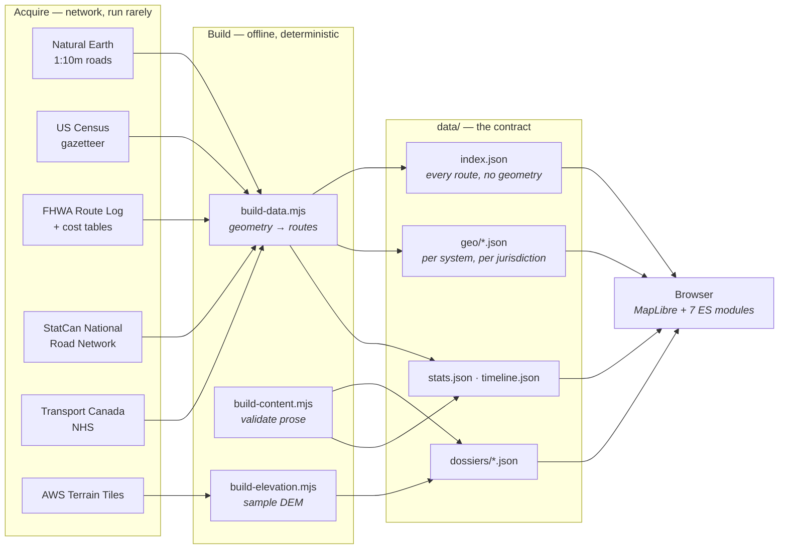
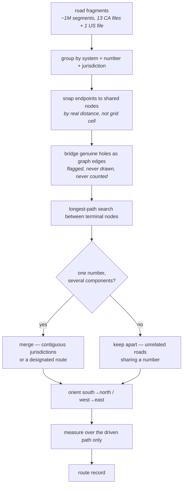
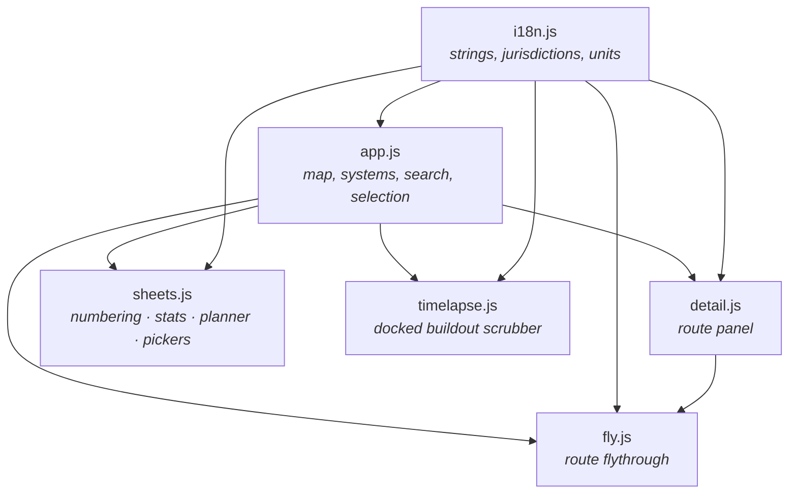

# Architecture

How Highway Atlas is put together, and why it is put together that way. This document
describes the parts that do not change with a rebuild: the shape of the pipeline, the
contract between the build and the client, and the rules the data has to obey.

For what the site *contains*, see the [README](../README.md). For the accuracy rules in
particular, see [Two kinds of figure](#two-kinds-of-figure) below — it is the constraint
that most of the rest of the design exists to serve.

---

## 1. The shape of the thing

There is no server and no client build step. The published site is static files, and
everything expensive happens offline in Node scripts that write JSON into `data/`.

**Why offline.** Route reconstruction is a shortest-path search over a graph of a million
road fragments. It takes about twenty-five minutes and several gigabytes of source
shapefiles. Doing it once and shipping the answer is the difference between a site that
loads in a second and one that cannot exist.

**Why no framework.** The whole client is seven ES modules and one vendored copy of
MapLibre. Nothing here needs reconciliation, a virtual DOM or a bundler, and not having
them means the site has no build step, no lockfile drift in what is served, and no reason
to stop working.

---

## 2. Two kinds of figure

Every number on the site is either **measured** from geometry or **published** by an
authority, and the two are never mixed, averaged, or used to fill in for one another.

| | Measured | Published |
| --- | --- | --- |
| Examples | length, termini, per-jurisdiction mileage, straight-line span, roadway-class mix, grade-separated share, lane counts, posted speeds | official mileage, construction cost, traffic counts, pavement condition, designation tier, completion year |
| Source | the road geometry itself | FHWA, Transport Canada, provincial and state DOTs |
| Shown with | a note saying it was derived and at what scale | a source line naming the publication and its date |
| When absent | cannot be absent — it is computed | the page says *no public figure*, and never estimates |

This is enforced, not merely intended. `build-content.mjs` fails the build if a figure
carries neither a source nor an explanation of its absence, or if English and Chinese are
not both present.

**The third case: derived-but-partial.** Some things are real but incomplete, and these are
the easiest to misrepresent. The buildout view is the clearest example: FHWA published
Interstate mileage open to traffic for every year from 1960 to 1997, but nobody published
an opening date per route. So the curve is the whole system and the map is the documented
subset, and the panel says which is which rather than letting a sparse map imply a small
network. The gap is missing records, not missing road.

---

## 3. From fragments to routes

The source files are not routes. They are road fragments, split at every jurisdiction line
and wherever a classification changes, with no notion that they belong to the same road.
Reassembling them is most of what `build-data.mjs` and `geo.mjs` do.

### Why each step exists

**Snapping by distance, not grid.** The two sides of a state line disagree by a few metres.
A grid-cell hash puts those endpoints in different buckets whenever the line happens to
fall near a cell boundary, which silently severs routes at arbitrary places.

**Bridging holes.** Some routes genuinely disappear from the source for a stretch — I-90
is missing the Indiana Toll Road and the Ohio Turnpike, a 420 km hole, because they are
filed under a different classification. Those routes are still one road, so the gap is
added to the graph as an edge and the end-to-end path falls out of a single search. The
bridge is then discarded: it is never drawn, and never counted as pavement. The detail
panel reports how much is missing.

**Merging, or not.** A number is not unique. There are eight unrelated I-295s. Distance
cannot make this call, because I-90's real hole is wider than the gap between two
different I-295s. So merging is decided by whether the jurisdictions the pieces run
through are contiguous, and for Canada also by whether the route is federally designated —
a designated route is one road even when it crosses water, as British Columbia's Highway 1
does by ferry.

**Measuring over the driven path.** A component contains more pavement than the road: both
carriageways of a divided highway, every ramp, every service lane. Canada's road file draws
each direction separately, so summing all of it made Ontario's Highway 401 1,819 km against
its published 828. Anything presented as a length is measured over the single path from one
terminus to the other; `geo.mjs` returns both measures and the build is explicit about
which it wants.

---

## 4. Client

`app.js` owns the map and the shared `app` state object; every other module reads from it
and calls back into it. `i18n.js` is a leaf — it imports nothing — which is what lets every
other module depend on it without cycles.

### Loading strategy

| Payload | When | Why |
| --- | --- | --- |
| `index.json` | at boot | every route in the network, without geometry, so search works before anything is drawn |
| `geo/interstate.json`, `geo/tch.json` | at boot | the two systems that are on by default |
| `geo/us.json`, `geo/nhs.json` | when switched on | large enough to be worth deferring |
| `geo/state/<ST>.json`, `geo/provincial/<PR>.json` | per jurisdiction, on demand | 10,000+ routes between them; shipping one file would be tens of megabytes |
| `dossiers/<id>.json` | when a route is opened | gated on a manifest, so a route without one costs no request |
| `elevation/<id>.json` | when a route is opened | same |

Search covers the whole network from `index.json` whether or not a system is drawn, so
typing a number finds it and switches its system on.

### Route identity

A route's `id` is its slug — `i-95`, `on-401`, `ca-1`. Where a number repeats, the id gains
a jurisdiction or an index, and the label gains a **place**: `where` names the terminus that
tells namesakes apart. Kentucky numbers five disconnected stretches 80; Ontario files some
thirty-five county roads under the same numbers as its provincial highways. Without the
place, a search for a number returns a column of identical rows.

---

## 5. Systems and tiers

Six systems in two countries. The two sets of tiers are not equivalents of one another,
which is why the interface groups them by country rather than listing all six as one
ladder.

| Country | System | Tier meaning | Default |
| --- | --- | --- | --- |
| US | Interstate | primary (1–2 digits), auxiliary (3 digits), special (business/bypass) | on |
| US | US Numbered Route | the pre-1956 national grid, numbered opposite to the Interstates | off |
| US | State Route | per state, loaded on demand | off |
| CA | Trans-Canada Highway | measured: carries the Trans-Canada for ≥25 km and ≥35% of its length | on |
| CA | National Highway System | designated by Transport Canada as Core, Feeder, or Northern and Remote | off |
| CA | Provincial & Municipal Route | every other numbered route, loaded per province | off |

**Why Canada's tier is measured rather than read.** The Trans-Canada is not a highway with
its own number. It is a designation carried by other highways for part of their length —
Quebec's A-20 carries it from the Ontario border to Rivière-du-Loup and then does not. So
the tier is decided after a route is stitched and its length is known, from how much of it
carries the designation, rather than from any single segment.

**Alaska's Interstates are declared, not read.** A-1 through A-4 are federally designated
and carry no Interstate shields at all, so no amount of reading the geometry will find
them. They are declared in `content/reference/alaska-interstates.json` as the state routes
they overlay plus their two termini, and built by a shortest-path search between those
termini. Without this, Alaska looks like it has no Interstates, which is how it came to
look absent from the map in the first place.

---

## 6. Source quirks worth knowing

Everything below is a real property of a public dataset, discovered by reading it, and each
one produced a visibly wrong atlas before it was handled.

| Source | Quirk | Effect if taken literally | Handling |
| --- | --- | --- | --- |
| StatCan NRN (NS) | `RTNUMBER` is `0` for a road with no route number | one 42,465 km "Highway 0" — 23,200 km of residential street and 18,400 km of logging road, five times the province's real network | a leading zero is the absent value |
| StatCan NRN (YT, NT) | numbers written as decimals — `1.0`, `37.0` | matched nothing in the federal register; split the Klondike Highway into two roads | decimal trimmed |
| StatCan NRN (NL) | local access roads numbered off their parent — `430-15` | 2,504 false routes against 144 real ones | excluded: addresses, not routes |
| StatCan NRN (ON) | county and municipal numbers in the same field as provincial highways, same road class | "ON 4" is Highway 4 plus ~35 unrelated county roads | kept, and the tier is named for it; each told apart by place |
| StatCan NRN (all) | each direction of a divided highway is a separate centreline | Highway 401 measured 1,819 km against 828 published | lengths measured over the driven path |
| Transport Canada NHS | StatCan's own NHS layers return nothing for NT and YT | two territories with published NHS mileage showed none | designation taken from Transport Canada's service instead |
| Natural Earth | fragments split at state lines and classification changes | routes severed into dozens of pieces | snapping and bridging, above |
| Natural Earth | 1:1,000,000 generalisation | measured lengths run short on curves | reported alongside the published figure, with the difference named |

---

## 7. Checks

| Command | Checks |
| --- | --- |
| `node tools/check-i18n.mjs` | English/Chinese key parity, placeholder agreement, keys asked for but undefined, keys defined but unread |
| `node tools/build-content.mjs` | every figure has a source or a stated reason for absence; both languages present |
| `node tools/verify.mjs` | drives the real site in headless Chromium: boot, search, selection, detail metrics, termini, cost figures, flythrough, terrain, basemaps, region jumps, Canadian metrics, marker overflow, panel collapse |

`verify.mjs` asserts on parsed source data rather than on rendered tiles, because
`querySourceFeatures` reports zero both when loading failed and when the map has simply not
repainted yet — and with no GPU in CI, repaints come when they come. Screenshots are
written to `tools/shots/` as diagnostics, not assertions.
