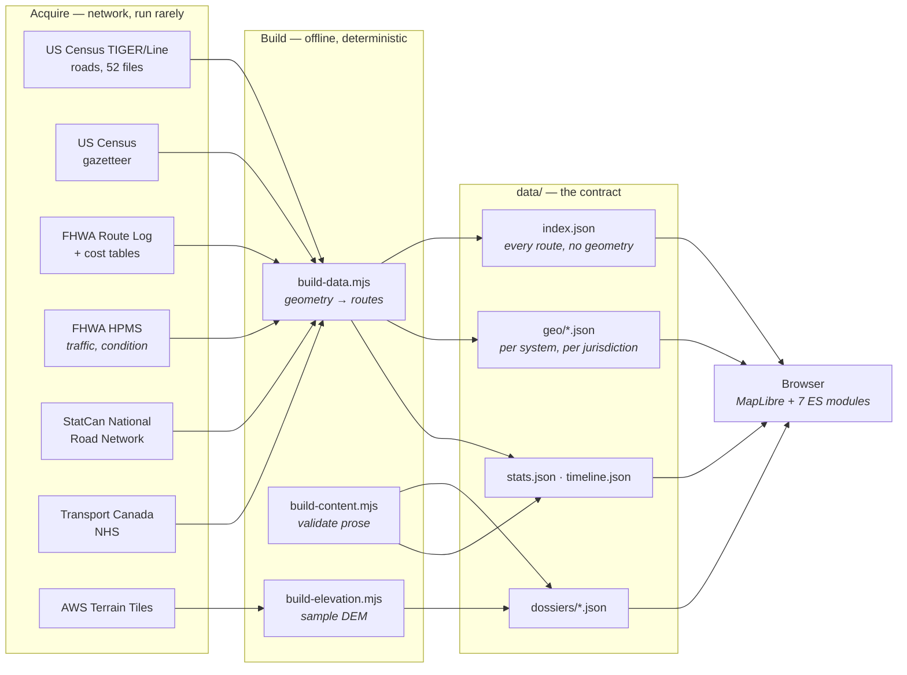
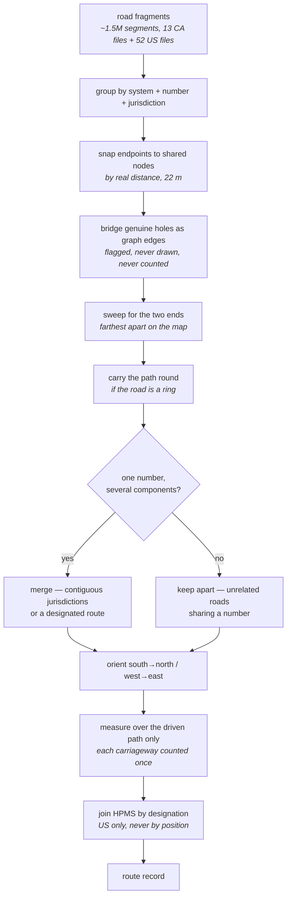
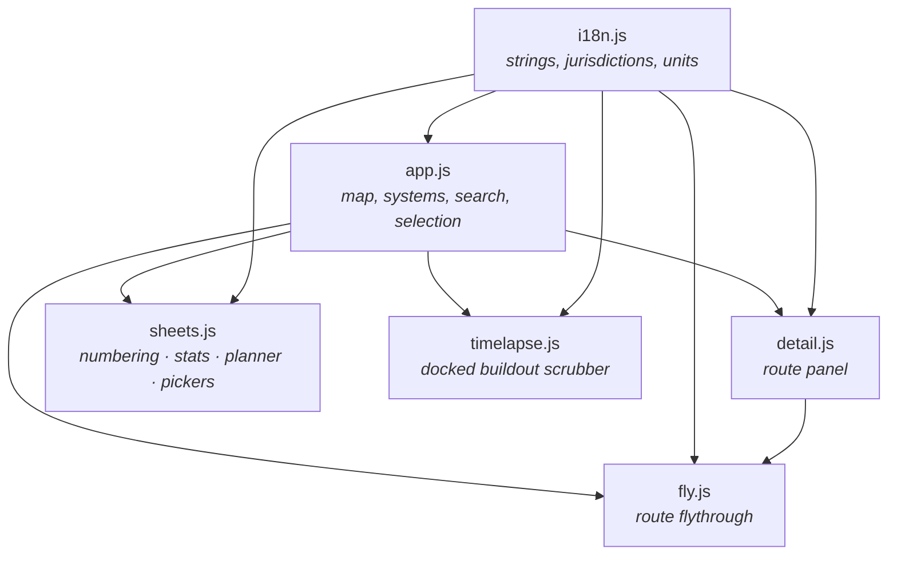

# Architecture

How Highway Atlas is put together, and why it is put together that way. This document
describes the parts that do not change with a rebuild: the shape of the pipeline, the
contract between the build and the client, and the rules the data has to obey.

For what the site *contains*, see the [README](../README.md). For the accuracy rules in
particular, see [Two kinds of figure](#two-kinds-of-figure) below — it is the constraint
that most of the rest of the design exists to serve.

---

## 1. The shape of the thing

There is no server and no client build step. The published site is static files, and
everything expensive happens offline in Node scripts that write JSON into `data/`.

**Why offline.** Route reconstruction is a shortest-path search over a graph of a million
road fragments. It takes about twenty-five minutes and several gigabytes of source
shapefiles. Doing it once and shipping the answer is the difference between a site that
loads in a second and one that cannot exist.

**Why no framework.** The whole client is seven ES modules and one vendored copy of
MapLibre. Nothing here needs reconciliation, a virtual DOM or a bundler, and not having
them means the site has no build step, no lockfile drift in what is served, and no reason
to stop working.

---

## 2. Two kinds of figure

Every number on the site is either **measured** from geometry or **published** by an
authority, and the two are never mixed, averaged, or used to fill in for one another.

| | Measured | Published |
| --- | --- | --- |
| Examples | length, termini, per-jurisdiction mileage, straight-line span, roadway-class mix, grade-separated share, lane counts, posted speeds | official mileage, construction cost, traffic counts, pavement condition, designation tier, completion year |
| Source | the road geometry itself | FHWA, Transport Canada, provincial and state DOTs |
| Shown with | a note saying it was derived and at what scale | a source line naming the publication and its date |
| When absent | cannot be absent — it is computed | the page says *no public figure*, and never estimates |

This is enforced, not merely intended. `build-content.mjs` fails the build if a figure
carries neither a source nor an explanation of its absence, or if English and Chinese are
not both present.

**The third case: derived-but-partial.** Some things are real but incomplete, and these are
the easiest to misrepresent. The buildout view is the clearest example: FHWA published
Interstate mileage open to traffic for every year from 1960 to 1997, but nobody published
an opening date per route. So the curve is the whole system and the map is the documented
subset, and the panel says which is which rather than letting a sparse map imply a small
network. The gap is missing records, not missing road.

---

## 3. From fragments to routes

The source files are not routes. They are road fragments, split at every jurisdiction line
and wherever a classification changes, with no notion that they belong to the same road.
Reassembling them is most of what `build-data.mjs` and `geo.mjs` do.

### Why each step exists

**Snapping by distance, not grid.** The two sides of a state line disagree by a few metres.
A grid-cell hash puts those endpoints in different buckets whenever the line happens to
fall near a cell boundary, which silently severs routes at arbitrary places.

**Snapping tightly.** The tolerance is 22 m for both national files, because both are
surveyed to around 10 m. Too tight severs routes at the joins; too loose is worse and less
obvious. Both sources draw each direction of a divided highway as its own centreline,
often within 30 m of the other, so at a loose tolerance the two carriageways weld into a
single graph wherever they pass close — and the through path then zigzags between them,
cutting every corner. That alone cost Highway 17 two thirds of its length. The 275 m
tolerance this once used was inherited from Natural Earth's 1:1,000,000 generalisation and
nothing needs it now.

**Finding the ends by sweeping every node, and sweeping across the map rather than along
the road.** Both halves of that were bugs, and each produced a confidently wrong number.

Considering only dead ends is wrong on exactly the roads that matter most: on a divided
freeway drawn with its ramps, nearly every node has degree three or more and the few
degree-one nodes are ramp stubs. Highway 401 had precisely two of them, 2 km apart, so an
828 km motorway was reconstructed as the 3 km between two off-ramps, and it looked
plausible enough in a list of route lengths to survive until someone checked it against a
published figure.

Sweeping by road distance instead looks more principled than measuring across the map, and
is also wrong, because the longest simple path through a dual carriageway runs out along
one side and back down the other. That path repeats no node, so nothing rules it out, and
it is close to twice the length of the road: Rhode Island's Interstates came to 141 miles
against a published 71. The ends are chosen geographically and the route between them is
found by road, which gives the journey rather than the tour.

**Carrying the path round a ring.** A beltway has no two ends, so the path between its two
most separated points is an arc and the rest of the road falls into the branches.
Indianapolis's I-465 measured 8 miles of a 53-mile loop that way and Atlanta's I-285 29 of
63. So once the path is found, the graph is searched again for a way back that shares no
pavement with it. On a ring there is one — the rest of the ring — and the two halves
together are the road. On an ordinary highway there is none, because removing the road
removes the only route between its ends, and nothing changes.

The case this must not mistake for a ring is a divided highway whose carriageways join at
both ends, where the way back is the other side of the same road and adding it would
report double. The two are told apart by the same coincidence test used on duplicate
components: a carriageway runs within 80 m of its partner for nearly its whole length,
while the far side of a beltway is miles from the near side.

**Bridging holes.** Some routes genuinely disappear from the source for a stretch — I-90
is missing the Indiana Toll Road and the Ohio Turnpike, a 420 km hole, because they are
filed under a different classification. Those routes are still one road, so the gap is
added to the graph as an edge and the end-to-end path falls out of a single search. The
bridge is then discarded: it is never drawn, and never counted as pavement. The detail
panel reports how much is missing.

**Merging, or not.** A number is not unique. There are eight unrelated I-295s. Distance
cannot make this call, because I-90's real hole is wider than the gap between two
different I-295s. So merging is decided by whether the jurisdictions the pieces run
through are contiguous, and for Canada also by whether the route is federally designated —
a designated route is one road even when it crosses water, as British Columbia's Highway 1
does by ferry.

**Counting each carriageway once.** Whether a divided highway's two sides end up as one
graph component or two is not a fact about the road. It depends on whether the source
files the connecting ramps under the same number: the Canadian network does, so its
carriageways join at every interchange, while TIGER gives a ramp its own name, so an
American beltway arrives as two separate rings. Both shapes have to be handled, and a
third besides.

| shape | example | what goes wrong | correction |
| --- | --- | --- | --- |
| carriageways as two components | Columbus I-270 | adding them reports 110 mi of a 55 mi loop | the component lying on one already counted is drawn, not measured |
| both folded into one line, out and back | Albany I-787 | a 10 mi road recorded as a 19 mi closed loop; no second component to discard | the stretch laid on top of itself is counted once |
| carriageways welded by loose snapping | Ontario 401 | the path zigzags between the sides, cutting corners | tight snapping, above |

Both coincidence tests require the overlap to be **distant along the road**, not merely
nearby in space. That is the whole difference between a returning carriageway, which comes
back alongside itself miles later, and a mountain switchback, which doubles back within a
few hundred metres and is genuine distance driven. US 395 over its passes and the Million
Dollar Highway are unchanged by both corrections.

**Measuring over the driven path.** A component contains more pavement than the road: both
carriageways of a divided highway, every ramp, every service lane. Canada's road file draws
each direction separately, so summing all of it made Ontario's Highway 401 1,819 km against
its published 828. Anything presented as a length is measured over the single path from one
terminus to the other; `geo.mjs` returns both measures and the build is explicit about
which it wants.

The correction is applied to each piece of the path rather than to the total, because the
total is not the only thing built from it. The miles in each state, the share that is
freeway and the share that is tolled are all added up from the same pieces, and discounting
only the headline left the Capital Beltway printing 68 miles above a state breakdown that
summed to 128. Every figure about a route's extent now comes off one measurement, so the
parts add up to the whole by construction.

### What this measure cannot do

A ring is carried round once, as above, but only where a clean second way back exists.
Where the source draws both carriageways of a loop as one line that goes out and comes
back — Baltimore's I-695 — the return shares pavement with the outbound path and is
rejected, so the road is measured across rather than around and comes out at 23 of its
published 46 miles. Quebec's Route 132 loops the Gaspé peninsula and comes out at 632 of
its published 928 for the same reason. The figure is reported as measured rather than
corrected toward the published one, which is shown beside it.

Where a number's pieces genuinely do not connect, they are kept as separate routes rather
than merged or dropped. Sometimes that is missing data and sometimes it is the road: Route
138's Lower North Shore section is reachable only by ferry, and it comes out as its own
route because that is what it is.

---

## 4. Client

`app.js` owns the map and the shared `app` state object; every other module reads from it
and calls back into it. `i18n.js` is a leaf — it imports nothing — which is what lets every
other module depend on it without cycles.

### Loading strategy

| Payload | When | Why |
| --- | --- | --- |
| `index.json` | at boot | every route in the network, without geometry, so search works before anything is drawn |
| `geo/interstate.json`, `geo/tch.json` | at boot | the two systems that are on by default |
| `geo/us.json`, `geo/nhs.json` | when switched on | large enough to be worth deferring |
| `geo/state/<ST>.json`, `geo/provincial/<PR>.json` | per jurisdiction, on demand | 10,000+ routes between them; shipping one file would be tens of megabytes |
| `dossiers/<id>.json` | when a route is opened | gated on a manifest, so a route without one costs no request |
| `elevation/<id>.json` | when a route is opened | same |

Search covers the whole network from `index.json` whether or not a system is drawn, so
typing a number finds it and switches its system on.

### Route identity

A route's `id` is its slug — `i-95`, `on-401`, `ca-1`. Where a number repeats, the id gains
a jurisdiction or an index, and the label gains a **place**: `where` names the terminus that
tells namesakes apart. Kentucky numbers five disconnected stretches 80; Ontario files some
thirty-five county roads under the same numbers as its provincial highways. Without the
place, a search for a number returns a column of identical rows.

---

## 5. Systems and tiers

Six systems in two countries. The two sets of tiers are not equivalents of one another,
which is why the interface groups them by country rather than listing all six as one
ladder.

| Country | System | Tier meaning | Default |
| --- | --- | --- | --- |
| US | Interstate | primary (1–2 digits), auxiliary (3 digits), special (business/bypass) | on |
| US | US Numbered Route | the pre-1956 national grid, numbered opposite to the Interstates | off |
| US | State Route | per state, loaded on demand | off |
| CA | Trans-Canada Highway | measured: carries the Trans-Canada for ≥25 km and ≥35% of its length | on |
| CA | National Highway System | designated by Transport Canada as Core, Feeder, or Northern and Remote | off |
| CA | Provincial & Municipal Route | every other numbered route, loaded per province | off |

**Why Canada's tier is measured rather than read.** The Trans-Canada is not a highway with
its own number. It is a designation carried by other highways for part of their length —
Quebec's A-20 carries it from the Ontario border to Rivière-du-Loup and then does not. So
the tier is decided after a route is stitched and its length is known, from how much of it
carries the designation, rather than from any single segment.

**Alaska's Interstates are declared, not read.** A-1 through A-4 are federally designated
and carry no Interstate shields at all, so no amount of reading the geometry will find
them. They are declared in `content/reference/alaska-interstates.json` as the state routes
they overlay plus their two termini, and built by a shortest-path search between those
termini. Without this, Alaska looks like it has no Interstates, which is how it came to
look absent from the map in the first place.

---

## 5a. What the states report: HPMS

Everything else in this atlas is a map. HPMS is a measurement: it is what each state
reports to FHWA every year about every mile of the federal-aid network — traffic counts,
truck volumes, pavement roughness, rutting, cracking, lane counts, speed limits, tolls,
and the year the road was last worked on. It is where the traffic and condition figures
come from, and it is the only source here that was collected by driving the road rather
than by drawing it.

Three decisions shape how it is used.

**Queried, not downloaded.** The 2024 release is 19.5 million sections and 49 GB as
published, which is not a defensible build dependency. The same data sits behind a query
API that will group and sum server-side, and the atlas needs one row per route per state —
29,894 rows, a few megabytes. The arithmetic happens at their end.

**Joined by designation, never by position.** HPMS names the route it describes, so its
figures are attached to this atlas's routes by state, system and number. No spatial join
is involved anywhere. That is deliberate: a spatial join would let a wrong geometry quietly
acquire the right traffic count, and the failure would be invisible. This way a join either
matches a designation or does not.

**Combined by measured mileage.** A route crossing fifteen states has fifteen HPMS records
and no national one. They are weighted by how much of the road this atlas measured in each
state, because I-95 is 15 miles of New Hampshire and 382 of Florida, and a flat average
would let New Hampshire's traffic count matter as much as Florida's.

Every figure carries the share of the route it was measured over, and the panel shows it.
This is the same rule as the two kinds of figure above: a measure over a fifth of a road,
presented as the road's, is a fabrication regardless of how carefully the fifth was
measured.

---

## 6. Source quirks worth knowing

Everything below is a real property of a public dataset, discovered by reading it, and each
one produced a visibly wrong atlas before it was handled.

| Source | Quirk | Effect if taken literally | Handling |
| --- | --- | --- | --- |
| StatCan NRN (NS) | `RTNUMBER` is `0` for a road with no route number | one 42,465 km "Highway 0" — 23,200 km of residential street and 18,400 km of logging road, five times the province's real network | a leading zero is the absent value |
| StatCan NRN (YT, NT) | numbers written as decimals — `1.0`, `37.0` | matched nothing in the federal register; split the Klondike Highway into two roads | decimal trimmed |
| StatCan NRN (NL) | local access roads numbered off their parent — `430-15` | 2,504 false routes against 144 real ones | excluded: addresses, not routes |
| StatCan NRN (ON) | county and municipal numbers in the same field as provincial highways, same road class | "ON 4" is Highway 4 plus ~35 unrelated county roads | kept, and the tier is named for it; each told apart by place |
| StatCan NRN (all) | each direction of a divided highway is a separate centreline | Highway 401 measured 1,819 km against 828 published | lengths measured over the driven path |
| Transport Canada NHS | StatCan's own NHS layers return nothing for NT and YT | two territories with published NHS mileage showed none | designation taken from Transport Canada's service instead |
| StatCan NRN (ON, QC) | the 400-series and the autoroutes are fully numbered, but drawn as dense ladders of dual carriageway and ramp | almost no degree-one nodes, so a dead-end heuristic picked ramp stubs as termini — Highway 401 at 3 km | ends found by sweeping every node |
| TIGER/Line | no route-number field; the designation is inside the road's name | nothing is a route | the name is parsed, against an audit of all 52 files ranked by mileage |
| TIGER/Line | former alignments keep their historic names — `Old US Hwy 395`, `Hst Rte 66` | a bypassed 1940s alignment spliced into the middle of the modern road | excluded |
| TIGER/Line | concurrencies written as one name — `US Hwy 11/15` | one of the two routes loses the shared stretch | read as both |
| TIGER/Line | local numbering conventions: `A1A`, `M 28`, `State Loop 265`, `FM 1960`, `AK Rte 3`, `Carr 156`, `I- H-1`, Missouri's lettered routes | Florida's A1A, Michigan's trunklines, Texas's farm roads, Hawaii's H-series and 1,600 mi of Missouri all absent | handled per state, narrowly |
| TIGER/Line | ramps are named separately from the highway, so carriageways do not connect | an American beltway arrives as two rings and measures twice the road | duplicate carriageway drawn, not measured |
| TIGER/Line | some divided highways are a single line drawn out and back | Albany's I-787, a 10 mi road, recorded as a 19 mi closed loop | self-overlap counted once |
| TIGER/Line | a road ends against the flank of another, and simplification has stripped the vertices from the straight run it meets | the Alaska Highway's nearest surviving vertex to the Tok junction is 5 km away, so Alaska's A-1 came out in two pieces 200 km apart | for declared overlay routes, the junction is projected onto the segment and the line cut there |
| FHWA HPMS | `route_signing` is reported by the states, and four do not report it usably | Texas identifies its Interstates and none of its other 338,000 mi | designation read from `route_id` for TX, MA and MD; Tennessee left unmatched |
| FHWA HPMS | condition is collected on the NHS and patchily elsewhere | a fifth of a road's roughness presented as the whole road's | every figure carries the share it was measured over |

---

## 7. Checks

| Command | Checks |
| --- | --- |
| `node tools/check-i18n.mjs` | English/Chinese key parity, placeholder agreement, keys asked for but undefined, keys defined but unread |
| `node tools/build-content.mjs` | every figure has a source or a stated reason for absence; both languages present |
| `node tools/verify.mjs` | drives the real site in headless Chromium: boot, search, selection, detail metrics, termini, cost figures, flythrough, terrain, basemaps, region jumps, Canadian metrics, marker overflow, panel collapse |

`verify.mjs` asserts on parsed source data rather than on rendered tiles, because
`querySourceFeatures` reports zero both when loading failed and when the map has simply not
repainted yet — and with no GPU in CI, repaints come when they come. Screenshots are
written to `tools/shots/` as diagnostics, not assertions.
