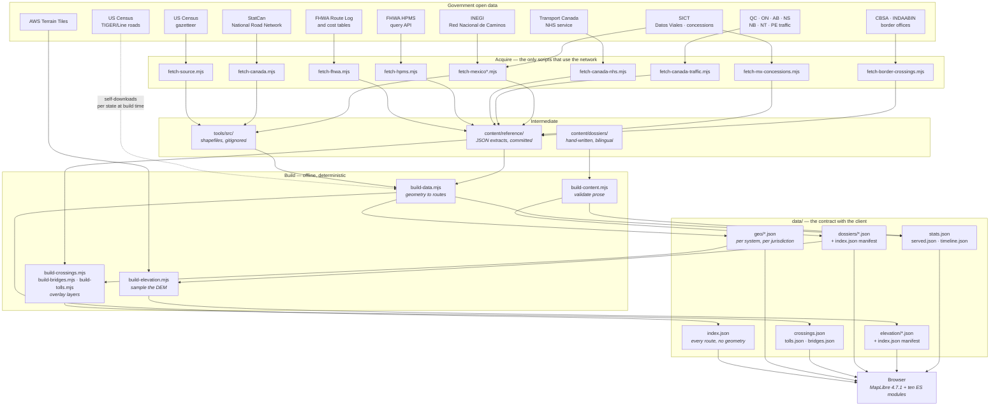
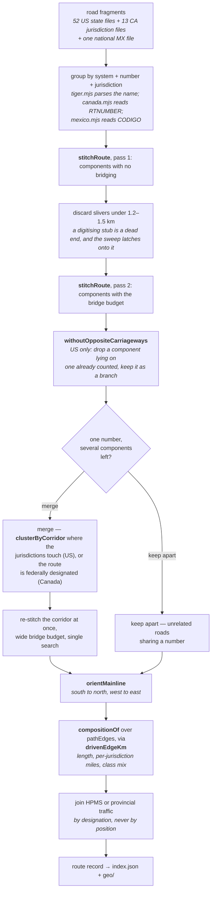
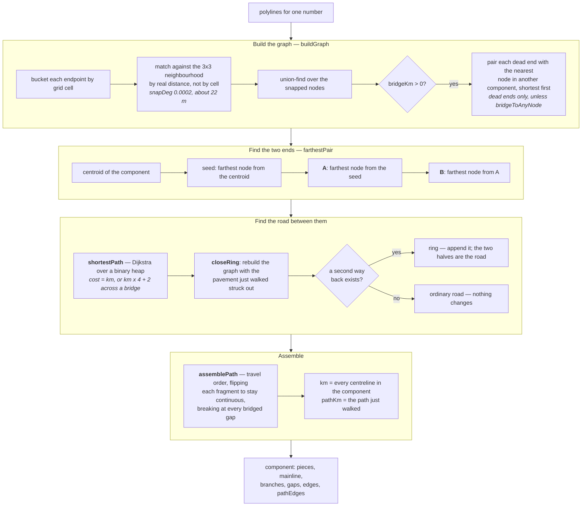
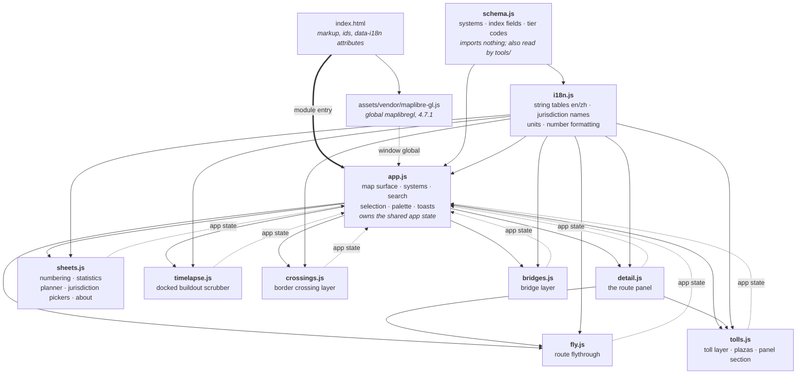
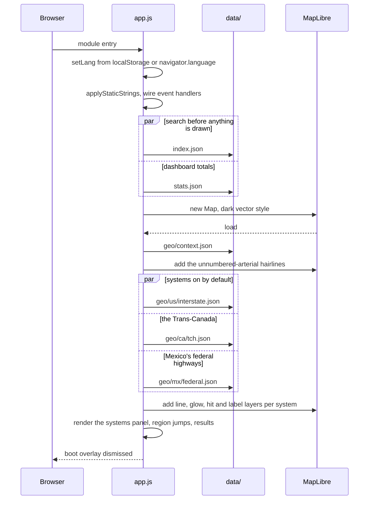

# Architecture

How Highway Atlas is put together, and why it is put together that way. This document
describes the parts that do not change with a rebuild: the shape of the pipeline, the
contract between the build and the client, and the rules the data has to obey.

For what the site *contains*, see the [README](../README.md); for every source and the
decisions about how each is used, [DATA-SOURCES.md](DATA-SOURCES.md). For the accuracy rules in
particular, see [Three kinds of figure](#2-three-kinds-of-figure) below, and
[ACCURACY.md](ACCURACY.md) for the long form — it is the constraint that most of the rest
of the design exists to serve.

Figures quoted below as examples — route counts, row counts, measured lengths — come from
the build dated **2026-09-17** and move with every rebuild. They are here to show the
order of magnitude and the failure they diagnose, not as facts about the network.

### Contents

| | |
| --- | --- |
| [1. The shape of the thing](#1-the-shape-of-the-thing) | pipeline, scripts, why offline |
| [2. Three kinds of figure](#2-three-kinds-of-figure) | the accuracy rule the design serves |
| [3. From fragments to routes](#3-from-fragments-to-routes) | the stitching algorithm |
| [4. Client](#4-client) | modules, boot, loading strategy |
| [5. Systems and tiers](#5-systems-and-tiers) | eight systems, three countries |
| [5a. What the states report: HPMS](#5a-what-the-states-report-hpms) | the one measured source |
| [6. Source quirks worth knowing](#6-source-quirks-worth-knowing) | every trap, and its handling |
| [7. Checks](#7-checks) | what is enforced, and how |

---

## 1. The shape of the thing

There is no server and no client build step. The published site is static files, and
everything expensive happens offline in Node scripts that write JSON into `data/`.

Acquisition and building are deliberately separate programs. The `fetch-*` scripts are the
only ones that touch the network; the `build-*` scripts read from disk, and given the same
inputs produce the same output. That is what makes a rebuild reviewable: the diff in
`data/` is attributable to a code change rather than to whatever the upstream server
happened to be serving that afternoon.

```mermaid
flowchart TB
  subgraph gov["Government open data"]
    direction LR
    G1["US Census<br/>TIGER/Line roads"]
    G2["US Census<br/>gazetteer"]
    G3["FHWA Route Log<br/>and cost tables"]
    G4["FHWA HPMS<br/>query API"]
    G5["StatCan<br/>National Road Network"]
    G6["Transport Canada<br/>NHS service"]
    G7["QC · ON · AB · NS<br/>NB · NT · PE traffic"]
    G9["INEGI<br/>Red Nacional de Caminos"]
    G10["SICT<br/>Datos Viales · concessions"]
    G11["CBSA · INDAABIN<br/>border offices"]
    G8["AWS Terrain Tiles"]
  end

  subgraph fetch["Acquire — the only scripts that use the network"]
    direction LR
    F1["fetch-source.mjs"]
    F2["fetch-fhwa.mjs"]
    F3["fetch-hpms.mjs"]
    F4["fetch-canada.mjs"]
    F5["fetch-canada-nhs.mjs"]
    F6["fetch-canada-traffic.mjs"]
    F7["fetch-mexico*.mjs"]
    F8["fetch-mx-concessions.mjs"]
    F9["fetch-border-crossings.mjs"]
  end

  subgraph inter["Intermediate"]
    direction LR
    SRC["tools/src/<br/><i>shapefiles, gitignored</i>"]
    REF["content/reference/<br/><i>JSON extracts, committed</i>"]
    DOSS["content/dossiers/<br/><i>hand-written, bilingual</i>"]
  end

  subgraph build["Build — offline, deterministic"]
    direction LR
    BD["build-data.mjs<br/><i>geometry to routes</i>"]
    BX["build-crossings.mjs<br/>build-bridges.mjs · build-tolls.mjs<br/><i>overlay layers</i>"]
    BC["build-content.mjs<br/><i>validate prose</i>"]
    BE["build-elevation.mjs<br/><i>sample the DEM</i>"]
  end

  subgraph out["data/ — the contract with the client"]
    direction LR
    IDX["index.json<br/><i>every route, no geometry</i>"]
    GEO["geo/*.json<br/><i>per system, per jurisdiction</i>"]
    LAY["crossings.json<br/>tolls.json · bridges.json"]
    DOS["dossiers/*.json<br/>+ index.json manifest"]
    ELEV["elevation/*.json<br/>+ index.json manifest"]
    ST["stats.json<br/>served.json · timeline.json"]
  end

  CLIENT["Browser<br/><i>MapLibre 4.7.1 + ten ES modules</i>"]

  G1 -.->|"self-downloads<br/>per state at build time"| BD
  G2 --> F1 --> SRC
  G3 --> F2 --> REF
  G4 --> F3 --> REF
  G5 --> F4 --> SRC
  G6 --> F5 --> REF
  G7 --> F6 --> REF
  G9 --> F7 --> SRC
  G10 --> F7
  F7 --> REF
  G10 --> F8 --> REF
  G11 --> F9 --> REF
  G8 --> BE

  SRC --> BD
  REF --> BD
  REF --> BX
  GEO --> BX
  DOSS --> BC
  DOS --> BE

  BD --> IDX
  BD --> GEO
  BD --> ST
  BX --> LAY
  BC --> DOS
  BC --> ST
  BE --> ELEV

  IDX --> CLIENT
  GEO --> CLIENT
  LAY --> CLIENT
  DOS --> CLIENT
  ELEV --> CLIENT
  ST --> CLIENT
```

TIGER/Line is the one large source with no fetch script of its own. It is published as one
archive per state and the build wants all fifty-two, so `tiger.mjs` downloads and unpacks
a state on first use and skips it thereafter — the download is part of reading a state,
not a separate stage. Natural Earth's admin-1 boundaries, which `mx-states.mjs` and
`border.mjs` need, are fetched the same way.

### What each script is for

| Script | Network | Reads | Writes |
| --- | :---: | --- | --- |
| `fetch-source.mjs` | ✅ | Census gazetteer archive | `tools/src/` |
| `fetch-fhwa.mjs` | ✅ | FHWA Route Log and Finder List pages | `content/reference/fhwa-mileage.json`, `fhwa-cost.json` |
| `fetch-hpms.mjs` | ✅ | the HPMS query API, grouped and summed server-side | `content/reference/hpms.json` |
| `fetch-canada.mjs` | ✅ | StatCan NRN, one archive per jurisdiction | `tools/src/ca/` |
| `fetch-canada-nhs.mjs` | ✅ | Transport Canada's NHS service and annual report | `content/reference/canada-nhs.json` |
| `fetch-canada-traffic.mjs` | ✅ | seven provincial and territorial feeds, seven different formats | `content/reference/ca-traffic.json` |
| `fetch-quebec-autoroutes.mjs` | ✅ | the MTQ *Répertoire des autoroutes*, in headless Chromium | `content/reference/qc-autoroutes.json` |
| `fetch-mexico.mjs` | ✅ | INEGI's Red Nacional de Caminos, resumable | `tools/src/mx/` |
| `fetch-mexico-traffic.mjs` | ✅ | SICT Datos Viales count stations | `content/reference/mx-traffic.json` |
| `fetch-mexico-designations.mjs` | ✅ | SICT's per-state road index PDFs | `content/reference/mx-designations.json` |
| `fetch-bridges.mjs` | ✅ | bridge inventories that carry a year built | `content/reference/bridges.json` |
| `fetch-border-crossings.mjs` | ✅ | CBSA's office directory, INDAABIN's border ports, the NRCan geocoder | `content/reference/border-crossings.json` |
| `fetch-mx-concessions.mjs` | ✅ | SICT's register of concession titles | `content/reference/mx-concessions.json` |
| `build-data.mjs` | ⚠️ TIGER, Natural Earth | `tools/src/`, `content/reference/` | `data/geo/`, `data/index.json`, `data/stats.json`, `data/served.json` |
| `build-crossings.mjs` | ❌ | `content/reference/border-crossings.json`, `data/geo/` | `data/crossings.json` |
| `build-bridges.mjs` | ❌ | `content/reference/bridges.json` | `data/bridges.json` |
| `build-tolls.mjs` | ❌ | `content/reference/tolls-ca.json`, `mx-concessions.json`, `mx-concession-matches.json`, `tools/src/mx/plaza_cobro`, `data/geo/` | `data/tolls.json` |
| `build-content.mjs` | ❌ | `content/dossiers/`, `content/reference/milestones.json` and `interstate-mileage.json`, `data/index.json`, `data/geo/` | `data/dossiers/`, `data/timeline.json` |
| `build-elevation.mjs` | ✅ tiles | `data/dossiers/index.json` for the route list, `data/geo/`, terrain tiles cached in `tools/cache/` | `data/elevation/` |
| `propose-mx-concession-matches.mjs` | ❌ | `mx-concessions.json`, `mx-designations.json`, `mx-traffic.json`, `data/geo/` | `content/reference/mx-concession-matches.json`, for a person to approve |
| `check-mexico-numbers.mjs` | ❌ | `mx-designations.json`, `data/geo/` | `content/reference/mx-crosscheck.json` |
| `check-i18n.mjs` | ❌ | `assets/*.js`, `index.html` | — |
| `check-data.mjs` | ❌ | everything in `data/` that names a route | — |
| `readme-figures.mjs` | ❌ | `data/stats.json`, `data/index.json`, `package.json` | the marked figures in `README.md` |
| `verify.mjs` | ✅ localhost | the served site | `tools/shots/` (gitignored) |
| `shoot-hero.mjs` | ✅ localhost | the served site | `docs/img/` — the two committed README images |
| `serve.mjs` | — | the repository | — |

The rest are libraries rather than programs: `geo.mjs` (all the geometry and graph work),
`tiger.mjs`, `canada.mjs` and `mexico.mjs` (the three source readers), `states.mjs` (state
codes and the land-border adjacency the corridor test uses), `mx-states.mjs` (which Mexican
state a point is in, since the road file does not say for federal roads) and `border.mjs`
(how far a point is from the US border). `unzip.mjs`, `xlsx.mjs` and `csv.mjs` exist
because the alternative was a dependency far larger than the slice of each format actually
needed — a Zip64-capable reader for archives that cross 4 GB uncompressed, enough of `.xlsx`
to read the provincial spreadsheets, and CSV decoding that establishes the encoding rather
than assuming UTF-8. `assets/schema.js` is shared with the browser: the systems, the index
fields and the tier codes are defined once there, so the build and the page cannot
disagree about them.

**Why offline.** Route reconstruction is a shortest-path search over a graph built from
every road fragment in three countries. It takes tens of minutes and several gigabytes of
source shapefiles. Doing it once and shipping the answer is the difference between a site
that loads in a second and one that cannot exist.

**Why no framework.** The whole client is nine ES modules and one vendored copy of
MapLibre. Nothing here needs reconciliation, a virtual DOM or a bundler, and not having
them means the site has no build step, no lockfile drift in what is served, and no reason
to stop working.

---

## 2. Three kinds of figure

Every number on the site is **measured** from geometry, **reported** by the agencies that
count the road, or **published** by an authority, and the three are never mixed, averaged,
or used to fill in for one another. [ACCURACY.md](ACCURACY.md) has the long form.

| | Measured | Reported | Published |
| --- | --- | --- | --- |
| Examples | length, termini, per-jurisdiction mileage, straight-line span, roadway-class mix, grade-separated share | traffic, heavy trucks, pavement condition, lanes, posted speeds, year last improved | official mileage, construction cost, designation tier, opening dates, toll facts and fares |
| Source | the road geometry itself | HPMS, the provinces that publish counts, SICT | FHWA, Transport Canada, provincial ministries, SICT, toll operators |
| Shown with | a note saying it was derived and at what scale | the share of the route it was measured over | a source line naming the publication and its date |
| When absent | cannot be absent — it is computed | nothing is shown, and nothing is inferred | the page says *no public figure*, and never estimates |

This is enforced, not merely intended. `build-content.mjs` fails the build if a figure
carries neither a source nor an explanation of its absence, or if English and Chinese are
not both present.

**The third case: derived-but-partial.** Some things are real but incomplete, and these are
the easiest to misrepresent. The buildout view is the clearest example: FHWA published
Interstate mileage open to traffic for every year from 1960 to 1997, but nobody published
an opening date per route. So the curve is the whole system and the map is the documented
subset, and the panel says which is which rather than letting a sparse map imply a small
network. The gap is missing records, not missing road.

---

## 3. From fragments to routes

The source files are not routes. They are road fragments, split at every jurisdiction line
and wherever a classification changes, with no notion that they belong to the same road.
Reassembling them is most of what `build-data.mjs` and `geo.mjs` do.

### The whole journey, per route number

```mermaid
flowchart TD
  A["road fragments<br/><i>52 US state files + 13 CA jurisdiction files<br/>+ one national MX file</i>"]
  B["group by system + number + jurisdiction<br/><i>tiger.mjs parses the name; canada.mjs reads RTNUMBER;<br/>mexico.mjs reads CODIGO</i>"]
  C["<b>stitchRoute</b>, pass 1: components with no bridging"]
  D["discard slivers under 1.2–1.5 km<br/><i>a digitising stub is a dead end, and the sweep latches onto it</i>"]
  E["<b>stitchRoute</b>, pass 2: components with the bridge budget"]
  F["<b>withoutOppositeCarriageways</b><br/><i>US only: drop a component lying on<br/>one already counted, keep it as a branch</i>"]
  G{"one number,<br/>several components<br/>left?"}
  H["merge — <b>clusterByCorridor</b> where the<br/>jurisdictions touch (US), or the route<br/>is federally designated (Canada)"]
  I["keep apart — unrelated roads<br/>sharing a number"]
  J["re-stitch the corridor at once,<br/>wide bridge budget, single search"]
  K["<b>orientMainline</b><br/><i>south to north, west to east</i>"]
  L["<b>compositionOf</b> over pathEdges, via<br/><b>drivenEdgeKm</b><br/><i>length, per-jurisdiction miles, class mix</i>"]
  M["join HPMS or provincial traffic<br/><i>by designation, never by position</i>"]
  N["route record → index.json + geo/"]

  A --> B --> C --> D --> E --> F --> G
  G -->|"merge"| H --> J --> K
  G -->|"keep apart"| I --> K
  K --> L --> M --> N
```

### Inside one stitch: `stitchComponents`

This is the core of it, and every branch below replaced a bug that produced a confidently
wrong number.

```mermaid
flowchart TD
  IN["polylines for one number"]

  subgraph bld["Build the graph — buildGraph"]
    N1["bucket each endpoint by grid cell"]
    N2["match against the 3x3 neighbourhood<br/>by real distance, not by cell<br/><i>snapDeg 0.0002, about 22 m</i>"]
    N3["union-find over the snapped nodes"]
    N4{"bridgeKm > 0?"}
    N5["pair each dead end with the nearest<br/>node in another component, shortest first<br/><i>dead ends only, unless bridgeToAnyNode</i>"]
    N1 --> N2 --> N3 --> N4
    N4 -->|yes| N5
  end

  subgraph term["Find the two ends — farthestPair"]
    E1["centroid of the component"]
    E2["seed: farthest node from the centroid"]
    E3["<b>A</b>: farthest node from the seed"]
    E4["<b>B</b>: farthest node from A"]
    E1 --> E2 --> E3 --> E4
  end

  subgraph walk["Find the road between them"]
    P1["<b>shortestPath</b> — Dijkstra over a binary heap<br/><i>cost = km, or km x 4 + 2 across a bridge</i>"]
    P2["<b>closeRing</b>: rebuild the graph with the<br/>pavement just walked struck out"]
    P3{"a second way<br/>back exists?"}
    P4["ring — append it; the two halves are the road"]
    P5["ordinary road — nothing changes"]
    P1 --> P2 --> P3
    P3 -->|yes| P4
    P3 -->|no| P5
  end

  subgraph meas["Assemble"]
    M1["<b>assemblePath</b> — travel order, flipping<br/>each fragment to stay continuous,<br/>breaking at every bridged gap"]
    M3["km = every centreline in the component<br/>pathKm = the path just walked"]
    M1 --> M3
  end

  IN --> bld --> term --> walk --> meas
  meas --> OUT["component: pieces, mainline,<br/>branches, gaps, edges, pathEdges"]
```

`stitchComponents` stops at the two lengths. The third correction — pavement the path
lays on top of *itself*, which happens where the source folded both directions of a
divided highway into one out-and-back line — is applied a step later, by `drivenEdgeKm`
inside `compositionOf`, because it has to be applied per edge rather than to the total.
Everything the panel says about a route's extent is summed from those edges, so
discounting only the headline left the Capital Beltway printing 68 miles above a state
breakdown that summed to 128.

Three tests in `geo.mjs` ask the same question — *does this piece of road lie on top of
that one?* — and all three share a mechanism worth naming, because it is what keeps them
from mistaking a mountain road for a doubled carriageway. `proximityIndex` samples a set
of polylines onto a grid sized to the tolerance and answers *is this point within 80 m of
any of them?* in constant time; `shareNear` then asks what fraction of another line's
sampled length scores a hit. A divided highway's two sides score near 1 against each
other; two roads that merely cross score near 0.

| Test | Asked by | Compares | Decides |
| --- | --- | --- | --- |
| is the way back the other carriageway, or the rest of the ring? | `closeRing` | every remaining edge against the path just walked | whether a beltway is carried round, or a dual carriageway refused |
| is this component the far side of one already counted? | `withoutOppositeCarriageways` | a whole component against the components already kept | whether a component is measured, or demoted to a branch that is drawn but not counted |
| does the path come back over itself? | `drivenEdgeKm` | the path against itself, point by point | how much of each edge is genuinely driven |

Only the third needs an extra guard, and it is the one that would otherwise misread a
mountain road: a point counts as doubled only if the path returns within 80 m *and* at
least 1.6 km further along itself. A switchback doubles back within a few hundred metres
and is genuine distance driven; a returning carriageway comes back miles later. The first
two are safe without it because they compare a piece of road against a *different* piece
— a switchback is inside the single path or component being tested, so it is never a
candidate.

### The constants, and what each is for

| Constant | Value | Where | Why that value |
| --- | --- | --- | --- |
| `US_SNAP` / `CA_SNAP` | `0.0002°`, about 22 m | `build-data.mjs` | both national files are surveyed to around 10 m; looser welds the two carriageways of a divided highway into one graph |
| `bridgeKm` | 60 km national, 40 km US state, 30 km CA undesignated | `build-data.mjs` | wide enough for I-90's missing turnpikes, narrow enough not to invent road |
| bridge cost | `km × 4 + 2` | `geo.mjs` | a straight line is always shorter than the road it spans, so without a penalty every bridge beats real pavement |
| `minComponentKm` | 1.2 km US, 1.5 km CA and MX | `build-data.mjs` | discards digitising slivers before they can be chosen as termini, unless every piece of the number is that short (D-42) |
| `dedupeTolKm` | 0.08 km, 80 m | `geo.mjs` | wider than a median, far narrower than the gap to a different road |
| coincidence share | 0.6 | `geo.mjs` | the fraction of a component that must lie on one already counted |
| `minAlongKm` | 1.6 km | `drivenEdgeKm` | separates a returning carriageway from a switchback |
| corridor bridge | 1,000 km US, 120 km CA | `build-data.mjs` | the US budget spans concurrencies inside an already-clustered corridor; Canada's refuses to bridge Lake Superior |
| Douglas–Peucker tolerance | 0.004–0.006° on output | `build-data.mjs` | drawing scale, roughly 1:1,000,000; endpoints are never moved |

### Why each step exists

**Snapping by distance, not grid.** The two sides of a state line disagree by a few metres.
A grid-cell hash puts those endpoints in different buckets whenever the line happens to
fall near a cell boundary, which silently severs routes at arbitrary places.

**Snapping tightly.** The tolerance is 22 m for both national files, because both are
surveyed to around 10 m. Too tight severs routes at the joins; too loose is worse and less
obvious. Both sources draw each direction of a divided highway as its own centreline,
often within 30 m of the other, so at a loose tolerance the two carriageways weld into a
single graph wherever they pass close — and the through path then zigzags between them,
cutting every corner. That alone cost Highway 17 two thirds of its length. The 275 m
tolerance this once used was inherited from Natural Earth's 1:1,000,000 generalisation and
nothing needs it now.

**Finding the ends by sweeping every node, and sweeping across the map rather than along
the road.** Both halves of that were bugs, and each produced a confidently wrong number.

Considering only dead ends is wrong on exactly the roads that matter most: on a divided
freeway drawn with its ramps, nearly every node has degree three or more and the few
degree-one nodes are ramp stubs. Highway 401 had precisely two of them, 2 km apart, so an
828 km motorway was reconstructed as the 3 km between two off-ramps, and it looked
plausible enough in a list of route lengths to survive until someone checked it against a
published figure.

Sweeping by road distance instead looks more principled than measuring across the map, and
is also wrong, because the longest simple path through a dual carriageway runs out along
one side and back down the other. That path repeats no node, so nothing rules it out, and
it is close to twice the length of the road: Rhode Island's Interstates came to 141 miles
against a published 71. The ends are chosen geographically and the route between them is
found by road, which gives the journey rather than the tour.

**Carrying the path round a ring.** A beltway has no two ends, so the path between its two
most separated points is an arc and the rest of the road falls into the branches.
Indianapolis's I-465 measured 8 miles of a 53-mile loop that way and Atlanta's I-285 29 of
63. So once the path is found, the graph is searched again for a way back that shares no
pavement with it. On a ring there is one — the rest of the ring — and the two halves
together are the road. On an ordinary highway there is none, because removing the road
removes the only route between its ends, and nothing changes.

The case this must not mistake for a ring is a divided highway whose carriageways join at
both ends, where the way back is the other side of the same road and adding it would
report double. The two are told apart by the same coincidence test used on duplicate
components: a carriageway runs within 80 m of its partner for nearly its whole length,
while the far side of a beltway is miles from the near side.

**Bridging holes.** Some routes genuinely disappear from the source for a stretch — I-90
is missing the Indiana Toll Road and the Ohio Turnpike, a 420 km hole, because they are
filed under a different classification. Those routes are still one road, so the gap is
added to the graph as an edge and the end-to-end path falls out of a single search. The
bridge is then discarded: it is never drawn, and never counted as pavement. The detail
panel reports how much is missing.

**Merging, or not.** A number is not unique. There are eight unrelated I-295s. Distance
cannot make this call, because I-90's real hole is wider than the gap between two
different I-295s. So merging is decided by whether the jurisdictions the pieces run
through are contiguous, and for Canada also by whether the route is federally designated —
a designated route is one road even when it crosses water, as British Columbia's Highway 1
does by ferry.

**Counting each carriageway once.** Whether a divided highway's two sides end up as one
graph component or two is not a fact about the road. It depends on whether the source
files the connecting ramps under the same number: the Canadian network does, so its
carriageways join at every interchange, while TIGER gives a ramp its own name, so an
American beltway arrives as two separate rings. Both shapes have to be handled, and a
third besides.

| shape | example | what goes wrong | correction |
| --- | --- | --- | --- |
| carriageways as two components | Columbus I-270 | adding them reports 110 mi of a 55 mi loop | the component lying on one already counted is drawn, not measured |
| both folded into one line, out and back | Albany I-787 | a 10 mi road recorded as a 19 mi closed loop; no second component to discard | the stretch laid on top of itself is counted once |
| carriageways welded by loose snapping | Ontario 401 | the path zigzags between the sides, cutting corners | tight snapping, above |

None of the three corrections mistakes a mountain road for a doubled carriageway. The two
that compare one piece of road against another cannot: a switchback lies inside the single
path or component under test. The one that compares the path against itself asks for the
overlap to be **distant along the road** as well as nearby in space, which is the whole
difference between a returning carriageway, coming back alongside itself miles later, and
a switchback doubling back within a few hundred metres of genuine distance driven. US 395
over its passes and the Million Dollar Highway are unchanged by all three.

**Measuring over the driven path.** A component contains more pavement than the road: both
carriageways of a divided highway, every ramp, every service lane. Canada's road file draws
each direction separately, so summing all of it made Ontario's Highway 401 1,819 km against
its published 828. Anything presented as a length is measured over the single path from one
terminus to the other; `geo.mjs` returns both measures and the build is explicit about
which it wants.

The correction is applied to each piece of the path rather than to the total, because the
total is not the only thing built from it. The miles in each state, the share that is
freeway and the share that is tolled are all added up from the same pieces, and discounting
only the headline left the Capital Beltway printing 68 miles above a state breakdown that
summed to 128. Every figure about a route's extent now comes off one measurement, so the
parts add up to the whole by construction.

### What this measure cannot do

A ring is carried round once, as above, but only where a clean second way back exists.
Where the source draws both carriageways of a loop as one line that goes out and comes
back — Baltimore's I-695 — the return shares pavement with the outbound path and is
rejected, so the road is measured across rather than around and comes out at 23 of its
published 46 miles. Quebec's Route 132 loops the Gaspé peninsula and comes out at 632 of
its published 928 for the same reason. The figure is reported as measured rather than
corrected toward the published one, which is shown beside it.

Where a number's pieces genuinely do not connect, they are kept as separate routes rather
than merged or dropped. Sometimes that is missing data and sometimes it is the road: Route
138's Lower North Shore section is reachable only by ferry, and it comes out as its own
route because that is what it is.

---

## 4. Client

`index.html` is the entire markup: a static page with no templating, loading one plain
`<script>` for MapLibre and one `<script type="module">` for `app.js`. Everything else is
ten ES modules the browser loads and resolves itself.

```mermaid
flowchart TD
  HTML["index.html<br/><i>markup, ids, data-i18n attributes</i>"]
  MLGL["assets/vendor/maplibre-gl.js<br/><i>global maplibregl, 4.7.1</i>"]
  APP["<b>app.js</b><br/>map surface · systems · search<br/>selection · palette · toasts<br/><i>owns the shared app state</i>"]
  SCH["<b>schema.js</b><br/>systems · index fields · tier codes<br/><i>imports nothing; also read by tools/</i>"]
  I18N["<b>i18n.js</b><br/>string tables en/zh · jurisdiction names<br/>units · number formatting"]
  DET["<b>detail.js</b><br/>the route panel"]
  SH["<b>sheets.js</b><br/>numbering · statistics<br/>planner · jurisdiction pickers · about"]
  TL["<b>timelapse.js</b><br/>docked buildout scrubber"]
  FLY["<b>fly.js</b><br/>route flythrough"]
  XG["<b>crossings.js</b><br/>border crossing layer"]
  TO["<b>tolls.js</b><br/>toll layer · plazas · panel section"]
  BR["<b>bridges.js</b><br/>bridge layer"]

  HTML --> MLGL
  HTML ==>|"module entry"| APP
  MLGL -.->|"window global"| APP

  APP --> DET
  APP --> SH
  APP --> TL
  APP --> FLY
  APP --> XG
  APP --> TO
  APP --> BR
  DET --> FLY
  DET --> TO

  DET -.->|"app state"| APP
  SH -.->|"app state"| APP
  TL -.->|"app state"| APP
  FLY -.->|"app state"| APP
  XG -.->|"app state"| APP
  TO -.->|"app state"| APP
  BR -.->|"app state"| APP

  SCH --> I18N
  SCH --> APP
  I18N --> APP
  I18N --> DET
  I18N --> SH
  I18N --> TL
  I18N --> FLY
  I18N --> XG
  I18N --> TO
  I18N --> BR
```

Solid arrows are the feature direction — `app.js` opens the panel, the sheet, the
scrubber, the flythrough, the three overlay layers. Dotted arrows back to `app.js` are the
shared state: every feature module imports the `app` object and a handful of functions
(`select`, `loadState`, `enableSystem`, `toast`, `fitTo`) from it. Those are genuine import
cycles, and they are fine here because ES modules resolve them and nothing runs at import
time.

`schema.js` is the one module that imports nothing, and `i18n.js` imports only it. That is
deliberate: they are the dependencies every other module has, so keeping them leaves is
what stops the cycles above from becoming a knot. `schema.js` is also imported by the build
scripts, which is why it holds plain data and touches neither the DOM nor Node.

### What each module owns

| Module | Owns | Does not touch |
| --- | --- | --- |
| `schema.js` | the eight system definitions, the `index.json` field order, tier codes, road-class colours, dossier section order | the DOM, the network |
| `app.js` | the MapLibre instance, the `app` state object, layer construction, search over `index.json`, the command palette, region jumps, basemaps and terrain, route shields, toasts | route prose, sheet content, animation |
| `i18n.js` | both string tables, jurisdiction names, unit and number formatting, the current language | the DOM |
| `detail.js` | the right-hand route panel: termini, measured metrics, composition bars, per-jurisdiction mileage, HPMS and provincial figures, dossier prose, elevation profile | the map |
| `sheets.js` | the modal overlay and everything in it: numbering explainer, statistics dashboard, trip planner, state and province pickers, about | the map, except to select and zoom through `app.js` |
| `timelapse.js` | the docked scrubber, the mileage curve, the year filter on the Interstate layers, the ghost layer and the flash animation | anything outside the Interstate system |
| `fly.js` | the flythrough camera, the trail and head layers | selection, which stays with `app.js` |
| `crossings.js` | the border crossing layer and its popup, with the routes near each crossing | route geometry |
| `tolls.js` | the toll facility layer and Mexico's toll plazas, their popups with dated fares, and the toll section of the route panel | route geometry |
| `bridges.js` | the bridge layer, coloured by year built, and its popup | route geometry; a bridge year never reaches the route panel |

### Boot

```mermaid
sequenceDiagram
  participant B as Browser
  participant A as app.js
  participant D as data/
  participant M as MapLibre

  B->>A: module entry
  A->>A: setLang from localStorage or navigator.language
  A->>A: applyStaticStrings, wire event handlers
  par search before anything is drawn
    A->>D: index.json
  and dashboard totals
    A->>D: stats.json
  end
  A->>M: new Map, dark vector style
  M-->>A: load
  A->>D: geo/context.json
  A->>M: add the unnumbered-arterial hairlines
  par systems on by default
    A->>D: geo/us/interstate.json
  and the Trans-Canada
    A->>D: geo/ca/tch.json
  and Mexico's federal highways
    A->>D: geo/mx/federal.json
  end
  A->>M: add line, glow, hit and label layers per system
  A->>A: render the systems panel, region jumps, results
  A-->>B: boot overlay dismissed
```

The boot bar is not decorative: the index and the statistics arrive before the map does,
so search is answerable before a single road is drawn. Loading only the Interstates at
this point was a bug — the Trans-Canada is also on by default, and its button sat lit
above an empty map — so every system flagged `on` in `schema.js` with a file of its own is
fetched here.

### Loading strategy

| Payload | When | Why |
| --- | --- | --- |
| `index.json` | at boot | every route in the network, without geometry, so search works before anything is drawn |
| `stats.json` | at boot | the dashboard totals and the per-jurisdiction mileage the pickers show |
| `geo/context.json` | at boot | faint hairlines for the unnumbered primary grid, so a city reads as a city |
| `geo/us/interstate.json`, `geo/ca/tch.json`, `geo/mx/federal.json` | at boot | the three systems that are on by default |
| `geo/us/numbered.json`, `geo/ca/nhs.json` | when switched on | large enough to be worth deferring |
| `geo/us/state/<ST>.json`, `geo/ca/provincial/<PR>.json`, `geo/mx/state/<ST>.json` | per jurisdiction, on demand | over 18,000 routes between them; shipping them as three files would be tens of megabytes |
| `dossiers/index.json` | once, in the background | the manifest that badges search results |
| `dossiers/<id>.json` | when a route is opened | gated on the manifest, so a route without one costs no request |
| `elevation/<id>.json` | when a route is opened | same; every route with a dossier has one |
| `served.json`, `timeline.json` | on demand | the towns an Interstate serves; the buildout scrubber |
| `crossings.json`, `tolls.json`, `bridges.json` | when the layer is switched on, or a route panel lists its tolls | the three overlay layers |

Search covers the whole network from `index.json` whether or not a system is drawn, so
typing a number finds it and switches its system on.

The manifests matter more than they look. A written dossier exists for fewer than two
hundred routes out of twenty-one thousand, and an elevation profile for the same few. Asking
for the file and catching the 404 would work, but it would fill the console with failures
on every other route, which is the kind of noise that hides a real error.

### The data contract

Everything the client reads is in `data/`, and the shapes are fixed.

| File | Shape | Notes |
| --- | --- | --- |
| `index.json` | `{ generated, fields, routes: [][] }` | positional rows, not objects — the field names are given once in `fields` rather than repeated twenty-one thousand times |
| `geo/*.json` | GeoJSON `FeatureCollection` | one `Feature` per route, `MultiLineString`; the full metrics ride in `properties` |
| `stats.json` | `{ bySystem, byState, byType, sources, mxBoundaries, mxTraffic, hpmsYear, caTraffic, canada, accuracy }` | aggregates for the dashboard, plus the build's own accuracy summary, which the README quotes |
| `crossings.json` | GeoJSON `FeatureCollection` of points, plus `sources`, `counts`, `unplaced` | one crossing each, saying how it was placed and which routes lie within `nearKm` |
| `tolls.json` | GeoJSON `FeatureCollection`, plus `facilities`, `titles`, `byRoute` | the drawn Canadian facilities; Mexico's toll plazas as points of `kind: "plaza"` carrying their own properties; Mexican concession titles keyed by route for the panel |
| `bridges.json` | `{ sets, missing, roads, fields, rows }`, positional rows as `index.json` | one structure per row; `set` indexes the inventory, `road` indexes `roads`; the browser builds the GeoJSON |
| `served.json` | `{ [routeId]: ["City, ST", …] }` | split out of the geometry because it is only read when a panel opens |
| `timeline.json` | `{ range, coverage, mileage, routes, events }` | the buildout scrubber's whole payload |
| `dossiers/index.json`, `elevation/index.json` | `{ ids: [] }` | manifests, so absence costs no request |

Two conventions in the feature properties are worth knowing before reading `detail.js`:

- **`np`** counts the leading linestrings that form the mainline, in travel order.
  Anything after them is branch geometry — drawn with the route, never part of the through
  path. Highlighting, fitting, the flythrough and the elevation profile all slice to `np`.
- **Nested properties come back as JSON strings.** Anything that has been through
  MapLibre's tile pipeline flattens objects, so `start`, `end`, `states`, `types`, `hpms`
  and `traffic` are re-parsed on read. For the same reason a clicked feature is only ever
  used to identify a route: it is clipped to its tile, and fitting the map to it would
  frame whichever fragment happened to be under the cursor. The loaded source data is
  looked up instead.

### Route identity

A route's `id` is its slug — `i-95`, `on-401`, `ca-1`. Where a number repeats, the id gains
a jurisdiction or an index, and the label gains a **place**: `where` names the terminus that
tells namesakes apart. Kentucky numbers five disconnected stretches 80; twenty-two separate
Ontario roads carry the number 21, county roads and provincial highways alike. Without the
place, a search for a number returns a column of identical rows.

---

## 5. Systems and tiers

Eight systems in three countries, defined once in `assets/schema.js`. The three sets of
tiers are not equivalents of one another, which is why the interface groups them by
country rather than listing all eight as one ladder.

| Country | System | Tier meaning | Default |
| --- | --- | --- | --- |
| US | Interstate | primary (1–2 digits), auxiliary (3 digits), special (business/bypass) | on |
| US | US Numbered Route | the pre-1956 national grid, numbered opposite to the Interstates | off |
| US | State Route | per state, loaded on demand | off |
| CA | Trans-Canada Highway | measured: carries the Trans-Canada for ≥25 km and ≥35% of its length | on |
| CA | National Highway System | designated by Transport Canada as Core, Feeder, or Northern and Remote | off |
| CA | Provincial & Municipal Route | every other numbered route, loaded per province | off |
| MX | Federal Highway | a carretera federal, numbered MEX-xxx; administrative, not functional | on |
| MX | State Highway | a carretera numbered by the state that administers it, loaded per state | off |

**Why Mexico's tiers say who maintains a road.** The Red Nacional de Caminos has no
functional classification, so nothing in it means "freeway". What it records is the body
that administers each segment, and that is what the two tiers are. The same file names the
federation, not a state, as the jurisdiction of every federal segment, so which state a
federal road runs through is found against Natural Earth's boundaries in `mx-states.mjs`.

**Why Canada's tier is measured rather than read.** The Trans-Canada is not a highway with
its own number. It is a designation carried by other highways for part of their length —
Quebec's A-20 carries it from the Ontario border to Rivière-du-Loup and then does not. So
the tier is decided after a route is stitched and its length is known, from how much of it
carries the designation, rather than from any single segment.

**Alaska's Interstates are declared, not read.** A-1 through A-4 are federally designated
and carry no Interstate shields at all, so no amount of reading the geometry will find
them. They are declared in `content/reference/alaska-interstates.json` as the state routes
they overlay plus their two termini, and built by a shortest-path search between those
termini. Without this, Alaska looks like it has no Interstates, which is how it came to
look absent from the map in the first place.

---

## 5a. What the states report: HPMS

Everything else in this atlas is a map. HPMS is a measurement: it is what each state
reports to FHWA every year about every mile of the federal-aid network — traffic counts,
truck volumes, pavement roughness, rutting, cracking, lane counts, speed limits, tolls,
and the year the road was last worked on. It is where the traffic and condition figures
come from, and it is the only source here that was collected by driving the road rather
than by drawing it.

Three decisions shape how it is used.

**Queried, not downloaded.** The 2024 release is 19.5 million sections and 49 GB as
published, which is not a defensible build dependency. The same data sits behind a query
API that will group and sum server-side, and the atlas needs one row per route per state —
29,894 of them in the 2026-09-17 build, a few megabytes. The arithmetic happens at their
end, and what is committed to `content/reference/hpms.json` is the answer, dated.

**Joined by designation, never by position.** HPMS names the route it describes, so its
figures are attached to this atlas's routes by state, system and number. No spatial join
is involved anywhere. That is deliberate: a spatial join would let a wrong geometry quietly
acquire the right traffic count, and the failure would be invisible. This way a join either
matches a designation or does not.

**Combined by measured mileage.** A route crossing fifteen states has fifteen HPMS records
and no national one. They are weighted by how much of the road this atlas measured in each
state, because I-95 is 15 miles of New Hampshire and 382 of Florida, and a flat average
would let New Hampshire's traffic count matter as much as Florida's.

Every figure carries the share of the route it was measured over, and the panel shows it.
This is the same rule as the three kinds of figure above: a measure over a fifth of a road,
presented as the road's, is a fabrication regardless of how carefully the fifth was
measured.

---

## 6. Source quirks worth knowing

Everything below is a real property of a public dataset, discovered by reading it, and each
one produced a visibly wrong atlas before it was handled.

| Source | Quirk | Effect if taken literally | Handling |
| --- | --- | --- | --- |
| StatCan NRN (NS) | `RTNUMBER` is `0` for a road with no route number | one 42,465 km "Highway 0" — 23,200 km of residential street and 18,400 km of logging road, five times the province's real network | a leading zero is the absent value |
| StatCan NRN (YT, NT) | numbers written as decimals — `1.0`, `37.0` | matched nothing in the federal register; split the Klondike Highway into two roads | decimal trimmed |
| StatCan NRN (NL) | local access roads numbered off their parent — `430-15` | 2,504 false routes against 144 real ones | excluded: addresses, not routes |
| StatCan NRN (ON) | county and municipal numbers in the same field as provincial highways, same road class | "ON 4" is Highway 4 plus ~35 unrelated county roads | kept, and the tier is named for it; each told apart by place |
| StatCan NRN (all) | each direction of a divided highway is a separate centreline | Highway 401 measured 1,819 km against 828 published | lengths measured over the driven path |
| Transport Canada NHS | StatCan's own NHS layers return nothing for NT and YT | two territories with published NHS mileage showed none | designation taken from Transport Canada's service instead |
| StatCan NRN (ON, QC) | the 400-series and the autoroutes are fully numbered, but drawn as dense ladders of dual carriageway and ramp | almost no degree-one nodes, so a dead-end heuristic picked ramp stubs as termini — Highway 401 at 3 km | ends found by sweeping every node |
| TIGER/Line | no route-number field; the designation is inside the road's name | nothing is a route | the name is parsed, against an audit of all 52 files ranked by mileage |
| TIGER/Line | former alignments keep their historic names — `Old US Hwy 395`, `Hst Rte 66` | a bypassed 1940s alignment spliced into the middle of the modern road | excluded |
| TIGER/Line | concurrencies written as one name — `US Hwy 11/15` | one of the two routes loses the shared stretch | read as both |
| TIGER/Line | local numbering conventions: `A1A`, `M 28`, `State Loop 265`, `FM 1960`, `AK Rte 3`, `Carr 156`, `I- H-1`, Missouri's lettered routes | Florida's A1A, Michigan's trunklines, Texas's farm roads, Hawaii's H-series and 1,600 mi of Missouri all absent | handled per state, narrowly |
| TIGER/Line | ramps are named separately from the highway, so carriageways do not connect | an American beltway arrives as two rings and measures twice the road | duplicate carriageway drawn, not measured |
| TIGER/Line | some divided highways are a single line drawn out and back | Albany's I-787, a 10 mi road, recorded as a 19 mi closed loop | self-overlap counted once |
| TIGER/Line | a road ends against the flank of another, and simplification has stripped the vertices from the straight run it meets | the Alaska Highway's nearest surviving vertex to the Tok junction is 5 km away, so Alaska's A-1 came out in two pieces 200 km apart | for declared overlay routes, the junction is projected onto the segment and the line cut there |
| FHWA HPMS | `route_signing` is reported by the states, and four do not report it usably | Texas identifies its Interstates and none of its other 338,000 mi | designation read from `route_id` for TX, MA and MD; Tennessee left unmatched |
| FHWA HPMS | condition is collected on the NHS and patchily elsewhere | a fifth of a road's roughness presented as the whole road's | every figure carries the share it was measured over |
| INEGI RNC | `JURISDI` is the federation for every federal segment | a federal highway crossing eight states located in none of them | located against Natural Earth's 1:10m states |
| INEGI RNC | the D suffix of a toll road is almost never written in `CODIGO` | MEX-15 and MEX-15D merged into one number | kept as one route; toll share from the per-segment toll flag |
| INEGI RNC | `VELOCIDAD` is a routing parameter, not a posted limit | invented speed limits on every Mexican road | not shown |
| INEGI / SICT | the two agencies number state roads independently | a SICT key that names a different road from the atlas route of the same number | the atlas follows INEGI; `check-mexico-numbers.mjs` records every disagreement |
| SICT concession register | most titles name their road in words, not by number | a concession attached to the wrong road by a loose name match | proposed by `propose-mx-concession-matches.mjs`, attached only when a person approves it |
| CBSA office directory | an address, never a coordinate | 116 crossings with nowhere to draw them | geocoded through NRCan, each saying how precisely; the rest placed where their highway meets the border |

---

## 7. Checks

There is no CI. The checks are five scripts, run by hand, and each one fails loudly
rather than warning quietly.

| Command | Fails on | Also reports |
| --- | --- | --- |
| `node tools/check-i18n.mjs` | a key in one language table and not the other; placeholders that differ between the two; a key the code asks `t()` for that no table defines | keys both tables define that nothing reads |
| `node tools/build-content.mjs` | a figure with a value but no source; a figure with neither a value nor a stated reason for its absence; a localised field missing either language; a dossier whose route cannot be resolved, or that resolves to a route another dossier already claims | English and Chinese paragraph counts that disagree; cost claims superseded by the FHWA table |
| `node tools/check-data.mjs` | a route id used twice; a geometry file and the index disagreeing on which routes it holds, or a per-jurisdiction file no route belongs to; a remnant under half a mile beside a longer piece of its number; a route filed in no jurisdiction; an id in dossiers, elevation, timeline, tolls, crossings or served places missing from the index | — |
| `node tools/readme-figures.mjs` | a README marker with no generator, or a generator with no marker; with `--check`, figures that no longer match the build | — |
| `node tools/verify.mjs` | any of 44 steps against the real site in headless Chromium | console errors and failed network requests |

`npm test` runs the first four, and the fourth rewrites the README's figures from the build.
The fifth needs `npm run serve` in another terminal.

**What the checks are guarding.** The i18n check exists because bilingual parity is the
kind of requirement that rots silently: a missing key falls back to English at runtime and
reads as a rendering bug rather than a missing translation. The fallback is deliberate — a
reader should never be shown a raw key — which is exactly why the absence has to be caught
here instead. The content check enforces the source-or-explanation rule from
[§2](#2-three-kinds-of-figure) at build time, so the rule cannot be quietly relaxed by
writing prose that ignores it.

**Why `verify.mjs` asserts the way it does.** It reads parsed source data rather than
rendered tiles, because `querySourceFeatures` reports zero both when loading failed and
when the map has simply not repainted yet — and headless, with no GPU, repaints come when
they come. Its 44 steps cover boot, search, selection, detail metrics, termini, official
cost figures on routes with and without a dossier, the numbering explainer, the dashboard,
the buildout scrubber opening and closing, the command palette, layer toggling, the
language switch, the flythrough, terrain on and off, per-state loading, marker overflow,
search reaching systems that are switched off, panel collapse and reopen, basemap
switching, the Alaska jump and its four unsigned Interstates, HPMS figures on a US route,
the Trans-Canada drawing by default, Canadian metrics, per-province loading, traffic
on a route in a publishing province, the unit switch, list sorting and following the map,
the colour key and hiding the interface, the buildout run stopping at its end, and the
border crossing, toll, toll plaza and bridge layers with their popups and panel sections. Screenshots go to
`tools/shots/` as diagnostics, not assertions; that directory is gitignored.

**What is not checked.** There is no test of the stitching itself beyond the accuracy
summary the build prints and writes into `data/stats.json` — the median, decile and
within-tolerance spread of measured length against the FHWA register, over every route the
register covers. That is deliberate: reporting it from the build rather than from a
sentence typed into the interface or the README means the claim cannot drift away from the
data. When
the geometry improves the page saying how good it is improves with it, and when it
regresses, that shows too.
